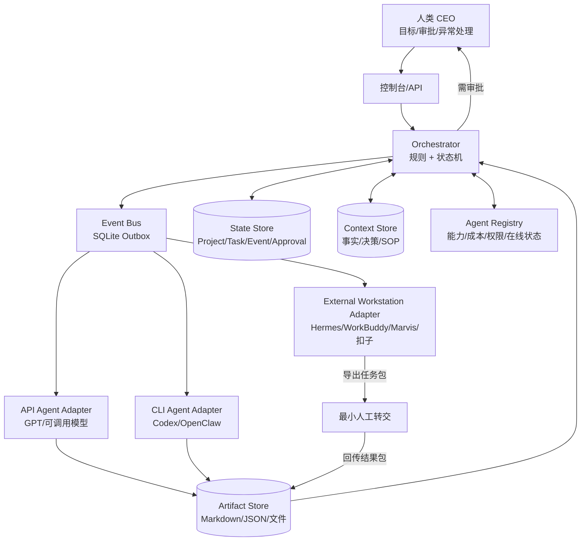

# AIOS V0 架构

## 五个中心

1. **Project Center**：目标、阶段、预算、风险。
2. **Task Center**：任务依赖、负责人、验收标准、截止时间。
3. **Context Center**：经过确认的事实、决策、品牌规则、客户资料。
4. **Event Center**：任务完成、失败、审批、上下文更新等事件。
5. **Agent Registry**：每个 AI 的能力、接入方式、成本和权限。

## 关键设计原则

- 单一事实源：状态只在 AIOS 中有效，聊天记录不是事实库。
- 事件驱动：完成任务产生事件，由规则生成下一任务。
- 适配器隔离：每个 Agent 的接入差异封装在 Adapter。
- 证据优先：成果物必须附来源、假设和置信度。
- 人类闸门：外部发布、删除、付款、客户承诺必须审批。
- 幂等：相同事件重复消费不得重复创建任务或外部操作。
