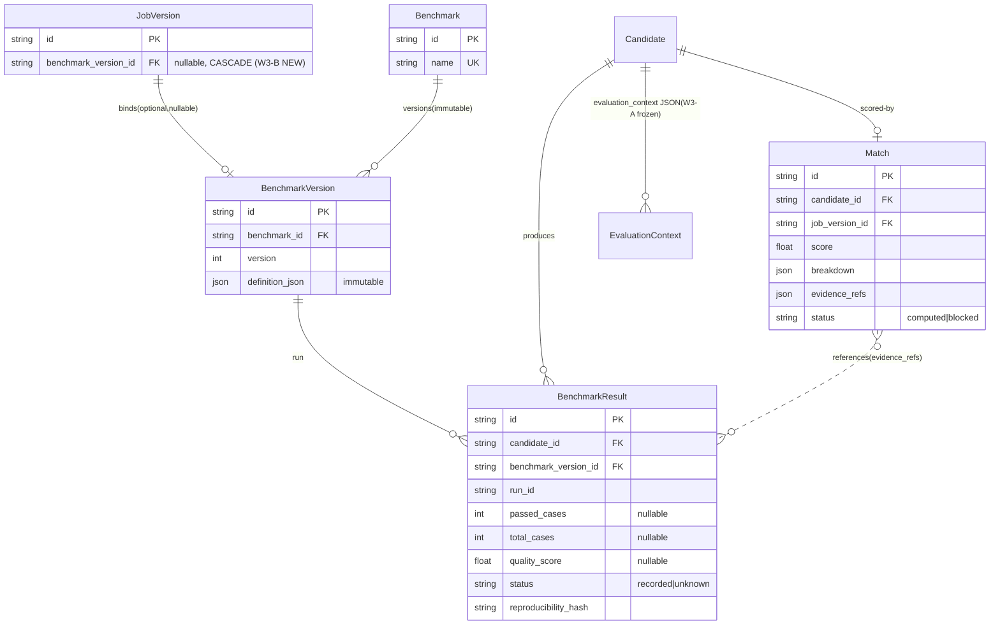

# Workforce W3-B — Match / Ranking & Benchmark Spec V1

> 设计文档（DESIGN ONLY）。本文件**不含任何实现代码、alembic migration、测试代码**。
> 实现须等 R7 对本文档明确的 exact-head SHA 显式授权 + DSH 路径③独立审计后，由 WorkBuddy 单兵 + 1qw23er squash-merge 落地。AI 绝不自动 merge。

## 0. 定位与边界（W3-B 只做这些）

本 Spec 是 W3 总设计（`Workforce_W3_Evaluation_Matching_Spec_V1.md`，下称 **W3-Spec**）在 W3-A 已冻结落地（`main@c367de9`，tree `600762a4…`）之后的**第二段实现设计**。

**W3-B 闭环目标**（来自用户指令）：

```
EVALUATED ──(compute_match)──▶ Match(score, breakdown, evidence_refs)
                              └─(rank_candidates)──▶ Ranking（查询，不落 Candidate 状态）
                                  │
                                  ├─ Benchmark 机制为 Match 提供可复现溯源证据（旁路）
                                  │   EVALUATED ──(run_benchmark)──▶ BenchmarkResult ──▶ evidence_refs
                                  │
                                  ▼ （以下严格留给 W3-C/D）
                              EVALUATED ──▶ RECOMMENDED（W3-C 状态边 + Approval 闸）
                              RECOMMENDED+Approved ──▶ Trial（W3-D）
```

**W3-B 做 / 不做对照表**

| 维度 | W3-B 做 | W3-B 不做（留 W3-C/D 或已冻结） |
|---|---|---|
| Benchmark 机制 | ✅ `benchmark`/`benchmark_version`/`benchmark_result` 三表 + `JobVersion.benchmark_version_id` 列 + `run_benchmark` 服务 | ❌ 不接 ai-arena / 外部 LLM 对抗式适配器（约束 8）；不消费 benchmark 做推荐决策 |
| Match / Ranking | ✅ `match` 表 + `compute_match` + `rank_candidates`（查询） | ❌ 不移动 `Candidate.status`；❌ 不引入 `EVALUATED→RECOMMENDED` 边（W3-C） |
| 评分 | ✅ `MATCH_WEIGHTS_V1` 聚合 `capability_fit` + `benchmark_score`(waived if unbound) | ❌ reliability/historical/cost 仍 `future_capability`/`unknown`，不进评分（约束 2） |
| 表 / 迁移 | ✅ **新增 4 表 + 1 列 → 必须 alembic migration**（与 W3-A 零迁移不同，见 §8） | ❌ 不修改 W1/W2/W3-A 任何已冻结语义（约束 1、9） |
| 复用 | ✅ Capability SSoT、`AgentCapability.priority`、`Scheduler/Execution/Budget/Audit/Approval` | ❌ 不重复造轮子（约束 3） |

**铁律复述**：W3-A 已冻结，禁止修改其既有语义（约束 1）；不虚构 reliability/historical/cost（约束 2）；不调 ruleset、不接 ai-arena（约束 8）。

---

## 1. 数据模型（`benchmark*` / `match` + `JobVersion.benchmark_version_id`）

> 以下为**设计示意**（SQLModel 风格），非实现。字段命名/类型对齐现有表惯例（`new_id("<prefix>")` PK、`now_utc()` 默认、`sa_column=Column(JSON)` 用于 JSON 包、`ondelete` 沿用现有策略）。

### 1.1 `benchmark`（基准模板，考试蓝本）

```
benchmark
  id: str = new_id("bm") PK
  name: str
  description: str = ""
  owner: str                     # 谁定义的基准（人类/系统），不强制 FK
  created_at: datetime = now_utc()
  __table_args__ = (UniqueConstraint("name", name="uq_benchmark_name"),)
```

### 1.2 `benchmark_version`（不可变版本快照）

```
benchmark_version
  id: str = new_id("bv") PK
  benchmark_id: str = FK(benchmark.id, ondelete="CASCADE", index)
  version: int = ge=1
  definition_json: dict = sa_column(JSON)   # cases 不可变快照 + 评分 rubric + 期望产出形态
  created_at: datetime = now_utc()
  __table_args__ = (UniqueConstraint("benchmark_id","version", name="uq_benchmark_version"),)
```

- **不可变**：`definition_json` 写入后禁止 UPDATE。换基准必须**新绑一个 version**（不 mutate 旧绑定）。这是防历史评估失真的关键（W3-Spec §4.4 / 风险 P1-1）。

### 1.3 `benchmark_result`（某 agent 在某 version 上的运行记录）

```
benchmark_result
  id: str = new_id("br") PK
  candidate_id: str = FK(candidate.id, ondelete="CASCADE", index)   # 软引用 agent 经 candidate
  benchmark_version_id: str = FK(benchmark_version.id, ondelete="RESTRICT", index)
  run_id: str                      # 单次运行标识（幂等键组分）
  passed_cases: int | None         # null ⇒ status=unknown（fail-closed 不写假成绩）
  total_cases: int | None
  quality_score: float | None      # 0..1 或 null；null ⇒ 未测/不可信
  input_hash: str                  # 受控输入的内容寻址（记录溯源，非 bit-exact）
  output_ref: str | None           # 指向输出存储的引用（不内联大结果）
  agent_snapshot_json: dict = JSON # 执行时 agent capability/priority 快照（溯源）
  environment: str = ""            # 运行环境标识（复现上下文）
  reproducibility_hash: str        # H(bv_id, case_set_hash, agent_id, agent_cap_snapshot, input_hash)
  status: str                      # "recorded" | "unknown"（fail-closed 兜底值）
  evaluator: str = "workforce_benchmark"
  created_at: datetime = now_utc()
  __table_args__ = (UniqueConstraint("candidate_id","benchmark_version_id","run_id",
                                      name="uq_benchmark_result_run"),)
```

- **证据不内联**：`output_ref` 仅存引用，`evaluation_context.benchmark_evidence` 也只存 `benchmark_result_id[]`（沿用 W3-Spec §2.3 / §4.3）。
- **fail-closed**：benchmark 不可信 → `status="unknown"`、`passed_cases/quality_score=None`，**绝不写 0 或估算值**（F2 在 W3-B 的延伸）。

### 1.4 `match`（EVALUATED 候选的匹配评分，与 Candidate 分离）

```
match
  id: str = new_id("mt") PK
  candidate_id: str = FK(candidate.id, ondelete="CASCADE", index)
  job_version_id: str = FK(job_version.id, ondelete="CASCADE", index)
  score: float                      # 0..1 聚合分（见 §2）
  weights_version: str = "w3b.match.v1"   # 锁定 MATCH_WEIGHTS_V1 版本
  breakdown: dict = JSON            # 各组件子分 + 权重 + 公式版本（可解释）
  evaluated_fields: list[str]       # ["capability_fit"] 或 ["capability_fit","benchmark_score"]
  evidence_refs: list[str]          # ["cand:<id>:attempt:N", "br:<benchmark_result_id>", ...]
  benchmark_version_id: str | None = FK(benchmark_version.id, ondelete="SET NULL", index)  # 绑定则填
  status: str = "computed" | "blocked"   # blocked ⇒ match_blocked_reason 非空
  match_blocked_reason: str | None       # "capability_gap" 等
  evaluator: str = "workforce_match"
  created_at: datetime = now_utc()
  __table_args__ = (UniqueConstraint("candidate_id","job_version_id",
                                      name="uq_match_candidate_job_version"),)
```

- **与 Candidate 分离**（W3-Spec §3.1）：可重排而不改评估快照。
- **可解释硬要求**：`breakdown` + `evidence_refs` 强制（约束 5）。

### 1.5 `JobVersion.benchmark_version_id`（head version 可选绑定）

```
JobVersion 新增列:
  benchmark_version_id: str | None = FK(benchmark_version.id, ondelete="CASCADE", index)
```

- 仅 **head version** 可绑（沿用 W1 不变历史原则）；历史版本不可变。
- 不绑 ⇒ Benchmark 维度在 Match 中 `waived`（约束 4 允许列但允许 null）。

### 1.6 状态流转澄清（W3-B **不移动候选状态**）

```
W3-A（已冻结）:  POOLED ─eval─▶ EVALUATING ─done─▶ EVALUATED ─reject─▶ REJECTED ─repool─▶ POOLED
                                              │
W3-B（本 Spec）:                               ├─ compute_match ─▶ Match（旁路，不改 status）
                                              ├─ run_benchmark ─▶ BenchmarkResult（旁路，不改 status）
                                              └─ rank_candidates ─▶ Ranking（纯查询，不改 status）
                                              │
W3-C（后续）:                                  EVALUATED ─recommend─▶ RECOMMENDED（新边，本 Spec 不装）
W3-D（后续）:                                  RECOMMENDED+Approved ─▶ Trial（新表，本 Spec 不装）
```

**关键边界**：W3-B 期间候选始终停在 `EVALUATED`。`RECOMMENDED` 仍保持 **零入边零出边**（W3-A 冻结态），任何 `EVALUATED→RECOMMENDED` 迁移在 W3-B 仍 409。Match/Ranking 是**评估快照之上的旁路评分层**，不写 `Candidate.status`、不写 `evaluation_context`（W3-A 已冻结，约束 1）。

---

## 2. Match / Ranking 评分契约

### 2.1 组件来源（复用 W3-A 已算证据）

- `capability_fit`：**恒 computed**。直接读 `Candidate.evaluation_context["capability_evidence"]`（W3-A 已算，含 `requirements[]`/`fit`/`threshold_passed`/`blocked_requirements`）。W3-B **不重算** capability_fit，只读。
- `benchmark_score`：**仅当** `JobVersion.benchmark_version_id` 绑定 **且** 存在 `status="recorded"` 的可信 `benchmark_result` 时 computed；否则 `waived`（null，不进分母）。
- `reliability` / `historical` / `cost`：**仍 `future_capability` / `unknown`**（W3-A 冻结语义），**不进入评分**（约束 2）。

### 2.2 `MATCH_WEIGHTS_V1`（在 W3-B `compute_match` 首次定义）

> 纠正 W3-Spec §5.2「W3-C 首次使用」措辞：用户本轮将 `compute_match` / Match 划给 **W3-B**，故 `MATCH_WEIGHTS_V1` 在 **W3-B** 定义（与 W3-A 设计文档 D9「不预置死常量」一致：在真正使用处定义，不猜未来权重）。

```
MATCH_WEIGHTS_V1 = {
  "capability_fit": 0.6,
  "benchmark_score": 0.4,    # 仅当 bound 且可信时计入
}
# 未绑 benchmark：benchmark_score 维度 waived，capability_fit 归一为 1.0（单组件）
```

### 2.3 聚合公式

```
required_present = ["capability_fit"] + (["benchmark_score"] if bound_and_recorded else [])

if not bound:
    score = capability_fit                    # 单组件归一，= capability_fit 本身
else:
    score = 0.6 * capability_fit + 0.4 * benchmark_score   # benchmark_score ∈ [0,1]
score = clamp(score, 0.0, 1.0)
```

- `capability_fit ∈ [0,1]`（W3-A 已 clamp，含除零守卫）。
- `benchmark_score = passed_cases / total_cases`（可加权 quality），`total_cases>0`；`total_cases=0` 或 `status≠recorded` ⇒ waived（不进分母，不写 0 假值）。

### 2.4 `breakdown` 必含字段（可解释性硬要求，约束 5）

```
breakdown = {
  "weights_version": "w3b.match.v1",
  "formula": "0.6*capability_fit + 0.4*benchmark_score (waived if unbound)",
  "capability_fit": { "value": <float>, "weight": 0.6,
                      "source": "evaluation_context.capability_evidence",
                      "threshold_passed": <bool> },
  "benchmark_score": { "value": <float> | None, "weight": 0.4,
                       "status": "computed" | "waived",
                       "reason": "JobVersion unbound" | "no recorded result" | null },
  "excluded": ["reliability(future_capability)", "historical(future_capability)", "cost(unknown/advisory)"]
}
```

### 2.5 `evidence_refs` 必含字段

```
evidence_refs = [
  f"cand:{candidate_id}:attempt:{evaluation_context['attempt']}",   # 锚定 W3-A 评估快照
  *([f"br:{benchmark_result_id}" for each recorded result] if bound else []),
]
```

### 2.6 fail-closed（约束 5「缺失必需证据必须 fail-closed」）

- **F1（沿用 W3-A 前向契约）**：`capability_evidence.threshold_passed == False` ⇒ `match.status="blocked"`、`match_blocked_reason="capability_gap"`。Match **仍产出**（含 score，capability_fit=0 自然垫底），但明确标记 blocked → W3-C `recommend_candidate` 必须读此字段并**拒绝推荐**。
- **F2（benchmark 不可信）**：`benchmark_result.status="unknown"` 或不存在 ⇒ `benchmark_score` waived（不写假值），score 退化为 `capability_fit`。
- **F3（缺 capability 证据）**：`evaluation_context` 无 `capability_evidence` 或候选非 `EVALUATED` ⇒ `compute_match` 抛 `ServiceError(422, "candidate not evaluable: ...")`（与 W3-A 的 422 风格一致），不静默造分。

### 2.7 `rank_candidates(job_version_id)`（查询，不改状态）

- 取该 `job_version` 下所有 `EVALUATED` 候选的 `Match` 记录，按 `score` 降序。
- tie-break：`capability_fit` → `benchmark_score`（若）→ `agent_id`（确定性）。
- `status="blocked"` 的 Match 排在所有 `computed` 之后（末位）。
- **纯查询，不落表、不写审计**（V1 不物化 ranking 快照；如需物化留 W3-C）。

---

## 3. Benchmark 输入 / 输出契约

### 3.1 抽象 seam：`BenchmarkAdapter`（Protocol，仅定义接口）

```
class BenchmarkAdapter(Protocol):
    def run(self, candidate: Candidate, benchmark_version: BenchmarkVersion) -> BenchmarkResult:
        ...
```

- W3-B **V1 实现内部确定性 benchmark**（pytest 风格脚本 / 确定性函数），**不接 ai-arena**（约束 8）。
- 外部 LLM 对抗式 benchmark 仅留接口，适配器实现留待后续阶段，且不得反向依赖 Workforce 核心（W3-Spec §4.5）。

### 3.2 输入

| 输入 | 来源 | 说明 |
|---|---|---|
| `benchmark_version.definition_json` | `benchmark_version` 表 | 不可变 cases + rubric |
| 受控输入 | `input_hash` 指向的存储 | 记录溯源，**非 bit-exact**（约束 6） |
| agent 快照 | `Candidate.agent_id` 软引用 → 执行时取 `AgentCapability.priority`/`enabled` | 落 `agent_snapshot_json` |

### 3.3 执行（复用现有设施，约束 3）

`run_benchmark` 经 **Scheduler/Execution** 触发 agent 跑 `definition_json` 的 cases，**不**新造执行引擎。`Budget.check_budget` 在触发前调用（复用，不重写）。

### 3.4 输出（`benchmark_result` 记录，见 §1.3）

- `status="recorded"`：真实运行成功，`passed_cases/total_cases/quality_score` 可填。
- `status="unknown"`：运行异常/输出缺失/校验失败 → **fail-closed 回退**，不写假成绩（F2）。
- `reproducibility_hash = H(benchmark_version_id, case_set_hash(definition_json), agent_id, agent_capability_snapshot, input_hash)`（约束 6「记录溯源可复现」）。

### 3.5 可复现 ≠ bit-exact（约束 6）

LLM Agent 本质非确定。可复现定义为：**给定相同 `reproducibility_hash` 五要素，可重新触发同一基准运行并比较趋势**（多次取稳定值）。绝不要求逐字节一致。换 agent 能力 / 换输入 / 换 version → hash 变 → 视为不同运行。

---

## 4. 幂等与 fail-closed 规则

### 4.1 `compute_match`（幂等）

- 键：`(candidate_id, job_version_id)`（UNIQUE 约束）。
- 重放同键：**幂等 no-op**（返回既有 Match，不重算、不写审计）。
- 若候选被 W3-A 重新 `evaluate`（新 attempt）→ 新 `evaluation_context` → `compute_match` 应**重算** Match 并保留审计轨迹（旧 Match 由 UPDATE 覆盖，审计记 before/after）。
- 并发：复用 W3-A 的 **SAVEPOINT 吸收 UNIQUE 冲突 → 读回权威行**范式（P2-1）；仍在 EVALUATED 的并发抢跑 → 采纳已完成者，否则 409（fail-closed > 静默）。

### 4.2 `run_benchmark`（幂等）

- 键：`(candidate_id, benchmark_version_id, run_id)`（UNIQUE 约束）。
- 重放同键 → 返回既有 `benchmark_result`（不重复运行）。
- 并发抢跑 → SAVEPOINT 409（复用 W3-A 范式）。
- 异常 → `benchmark_result.status="unknown"` + 回滚，绝不落半状态。

### 4.3 `rank_candidates`（查询）

- 纯读，无副作用，无幂等键需求。

### 4.4 fail-closed 总表

| 场景 | 行为 |
|---|---|
| capability 门槛未过 | `match.status="blocked"` + `match_blocked_reason="capability_gap"`；仍产出 score（垫底） |
| benchmark 不可信/未绑 | `benchmark_score` waived，score=capability_fit；不写 0 假值 |
| 候选非 EVALUATED / 无 capability_evidence | `compute_match` 抛 422，不造分 |
| benchmark 运行异常 | `benchmark_result.status="unknown"`，不写假成绩 |
| 并发抢跑 | SAVEPOINT 409（fail-closed，不静默成功） |

---

## 5. Audit 记录要求

复用 `append_audit(session, *, actor, action, resource_type, resource_id, project_id, task_id, before, after, idempotency_key)` + `redact_secrets`（W3-A 已验证契约）。

| 动作 | `action` | `resource_type`/`id` | `idempotency_key` | `after` 含 |
|---|---|---|---|---|
| 计算 Match | `match.computed` | `match` / `<match.id>` | `match:{candidate_id}:{job_version_id}` | `score`+`breakdown`+`evaluated_fields`+`status` |
| 运行 Benchmark | `benchmark.run` | `benchmark_result` / `<br.id>` | `benchmark:run:{candidate_id}:{benchmark_version_id}:{run_id}` | `benchmark_result_id`+`status`+`reproducibility_hash` |
| Match 重算覆盖 | `match.recomputed` | `match` / `<match.id>` | `match:{candidate_id}:{job_version_id}:{attempt}` | before/after `score` |

- `rank_candidates` **不写审计**（纯查询）。
- `project_id` / `task_id`：从 `Job` 关联取（若存在）；W3-B 不强依赖 project 上下文，缺失则 `None`。
- 脱敏：`redact_secrets` 自动对匹配 `SECRET_KEYS` 的键脱敏（W3-A 实测：`{"api_key":...}`→`[REDACTED]`；内嵌字符串不匹配，故测试须注入匹配键）。

---

## 6. 测试计划（列出断言，不写代码）

| ID | 名称 | 关键断言 |
|---|---|---|
| T-BENCH-1 | version 不可变 | `benchmark_version.definition_json` 写入后 UPDATE 抛错（或逻辑拒绝）；换基准须新 version |
| T-BENCH-2 | fail-closed 不写假成绩 | 运行异常 → `status="unknown"`、`passed_cases=None`、`quality_score=None`；**无任何数值** |
| T-BENCH-3 | 可复现 hash | `reproducibility_hash` 含 5 要素且同输入同值、改任一要素则变 |
| T-MATCH-1 | 可解释 | `compute_match` 产出 `breakdown`+`evidence_refs`+`evaluated_fields`；给定输入 `score` 可复算 |
| T-MATCH-2 | 未绑 benchmark | `benchmark_score` waived、`weights_version` 单组件归一、`score==capability_fit` |
| T-MATCH-3 | F1 capability_gap | required `priority<min_proficiency` → `match.status="blocked"`+`match_blocked_reason="capability_gap"`；ranking 末位 |
| T-MATCH-4 | 绑定且可信 | 存在 `recorded` result → `score` 含 `0.4*benchmark_score` 分量、`evaluated_fields` 含 `benchmark_score` |
| T-RANK-1 | 排序 | `rank_candidates` 按 `score` 降序；tie-break `capability_fit`→`benchmark_score`→`agent_id`；blocked 垫底 |
| T-IDEM-1 | 幂等 | `compute_match` / `run_benchmark` 重放同键不增副作用（UNIQUE 收敛）；并发 → SAVEPOINT 409 |
| T-AUDIT-1 | 审计 | `match.computed` / `benchmark.run` 审计轨迹完整 + `redact_secrets` 生效（注入匹配键验证） |
| T-REG-1 | W3-A 回归 | 已 `EVALUATED` 候选 `evaluation_context` 仍含 `capability_evidence`；W3-B **只读不写** `evaluation_context`；`Candidate.status` 在 W3-B 期间恒 `EVALUATED` |
| T-MIG-1 | 迁移纪律 | alembic 单 head、4 新表 + 1 列落地、downgrade 可回滚、无不可逆 schema |

---

## 7. 明确留给 W3-C / W3-D 的清单

### 7.1 留给 **W3-C（Recommendation）**

- `CandidateLifecycle` 接入 `EVALUATED → RECOMMENDED` 边（W3-A 当前零边，本 Spec 不装）。
- `recommendation` 表 + `recommend_candidate` 服务。
- **Approval 闸门（owner_inbox / L4）**：`RECOMMENDED → Trial` 的唯一人类闸门（约束 7 + W3-Spec §6.3），禁止任何自动绕过。
- 消费 `rank_candidates` 选 top-N；读 `match.status=="blocked"` → 拒绝推荐（F1 落地）。
- `MATCH_WEIGHTS_V1` 已在 W3-B 定义，W3-C 直接复用，不重定义。

### 7.2 留给 **W3-D（Trial）**

- `trial` 表 + `create_trial` + `execute_task` 接线（复用 Execution）。
- Trial 状态机 + 回写 `evaluation_context` 的 `trial_passed` 标记（仅参考，reliability 仍是 future_capability）。
- Employee 任命（含 Appointment 原子创建）归 **W4+**，不在 W3 任何段。

### 7.3 本 Spec **不碰**

- Employee / Training / Performance（约束 7，W4+）。
- ai-arena / 外部 LLM 对抗式 benchmark 适配器（约束 8，仅留 `BenchmarkAdapter` 接口）。
- ruleset（约束 8）。
- W1/W2/W3-A 已冻结语义、既有 migration、既有测试（约束 1、9）。

---

## 8. Migration Strategy（W3-B 需要 migration，与 W3-A 不同）

**关键差异**：W3-A 是零迁移（仅枚举提升 + JSON 写值，落在既有 `sa.String()` 列）。**W3-B 新增 4 个真实表 + `JobVersion` 加 1 列 → 必须有 alembic migration。**

- 新迁移（建议 `20260901_0001_workforce_match_benchmark`）：`add_benchmark` / `add_benchmark_version` / `add_benchmark_result` / `add_match` 四表 + `job_version.benchmark_version_id` 列（nullable FK CASCADE）。
- **单 head、additive、可逆**：新表不影响既有表数据；`downgrade` 删列 + 删表，可完整回滚。
- alembic head 维持**单一**（W3-A 后 head = `20260827_0002_workforce_candidate`；W3-B 在其上追加一跳）。
- **Gate 静态校验**（实现阶段）：`git diff --stat` 仅触及 `models.py`（新表类）+ `workforce.py`（服务）+ `alembic/versions/20260901_0001_*` + 测试；`CandidateStatus` / `CandidateLifecycle` / `evaluate_candidate` / `discover_candidates` **零改动**（W3-A 冻结）。

---

## 9. Open Questions（待 R7 拍板，不阻断 GO）

1. **benchmark 粒度**：V1 用 `benchmark_version.definition_json` 内含 cases（version 级总分），还是须独立 `benchmark_case` 表？本 Spec 默认前者以节流（同 W3-Spec §12 Q1）。
2. **`run_benchmark` 触发时机**：由 `compute_match` 自动触发（若绑定且无 recorded result），还是独立显式调用？本 Spec 默认**独立显式**（`compute_match` 只读既有 `benchmark_result`，不隐式跑 benchmark），避免 Match 调用产生副作用。
3. **`match` 重算策略**：候选重新 `evaluate`（新 attempt）后，`compute_match` 是自动重算还是需显式调用？本 Spec 默认**显式**（`rank_candidates` 前由调用方决定是否重算）。

---

## 10. W3-B Gate 判定

### 判定：**GO WITH CONDITIONS**

**理由**：设计完整覆盖用户强制清单（Match/Ranking 评分契约 + Benchmark 输入输出契约 + 数据模型 + 状态流转 + 幂等/fail-closed + Audit + 测试计划 + 明确 W3-C 留白），严格复用既有设施（Capability SSoT / `AgentCapability.priority` / Scheduler/Execution/Budget/Audit/Approval），未重复建设、未膨胀进 Employee/Training/Performance，且**明确划清 Benchmark 与 Match 边界**（Benchmark 是溯源证据机制、Match 是评分/排序层、二者经 `evidence_refs` 解耦）。W3-A 已成功落地的先例证明该分层可行。

**待 R7 确认的 4 项条件**（任一项存疑则降 NO-GO 直至澄清）：

1. **接受 W3-B 需要 alembic migration**（与 W3-A 零迁移不同）：新增 4 表 + `JobVersion` 1 列，单 head、additive、可逆。
2. **接受「W3-B 不移动候选状态」边界**：`EVALUATED→RECOMMENDED` 边严格留 W3-C；W3-B 期间候选恒 `EVALUATED`，Match/Ranking 是旁路评分层。
3. **接受不虚构评分铁律**：reliability/historical = `future_capability`、cost = `unknown`/advisory，三者**不进评分**；benchmark 不可信时 `status="unknown"` 不写假值。
4. **接受 benchmark「记录溯源可复现」定义**（非 bit-exact），且 V1 **不接 ai-arena**（仅留 `BenchmarkAdapter` 接口）。

条件达成即为 **GO**；授权后进入：W3-B implementation design → implementation → DSH 路径③独立审计(7 契约 A–G) → R7 对 exact-head SHA 显式授权 → 1qw23er squash-merge。**AI 绝不自动 merge。**

---

## 附录 A：ER 关系图（Mermaid，仅 W3-B 新增 + 既有引用）



> 实线=强引用（CASCADE/RESTRICT FK）；虚线=`nullable`/`evidence_refs` 软引用。Workforce 单向调用 Core（Registry/Capability/Scheduler/Execution/Budget/Knowledge/Audit/Approval），反向依赖禁止。新增表仅 `benchmark`/`benchmark_version`/`benchmark_result`/`match`（加 `JobVersion.benchmark_version_id` 列）；**不建** `recommendation`/`trial`/`Employee`/`Training`/`PerformanceSnapshot`（W3-C/D/W4）。
