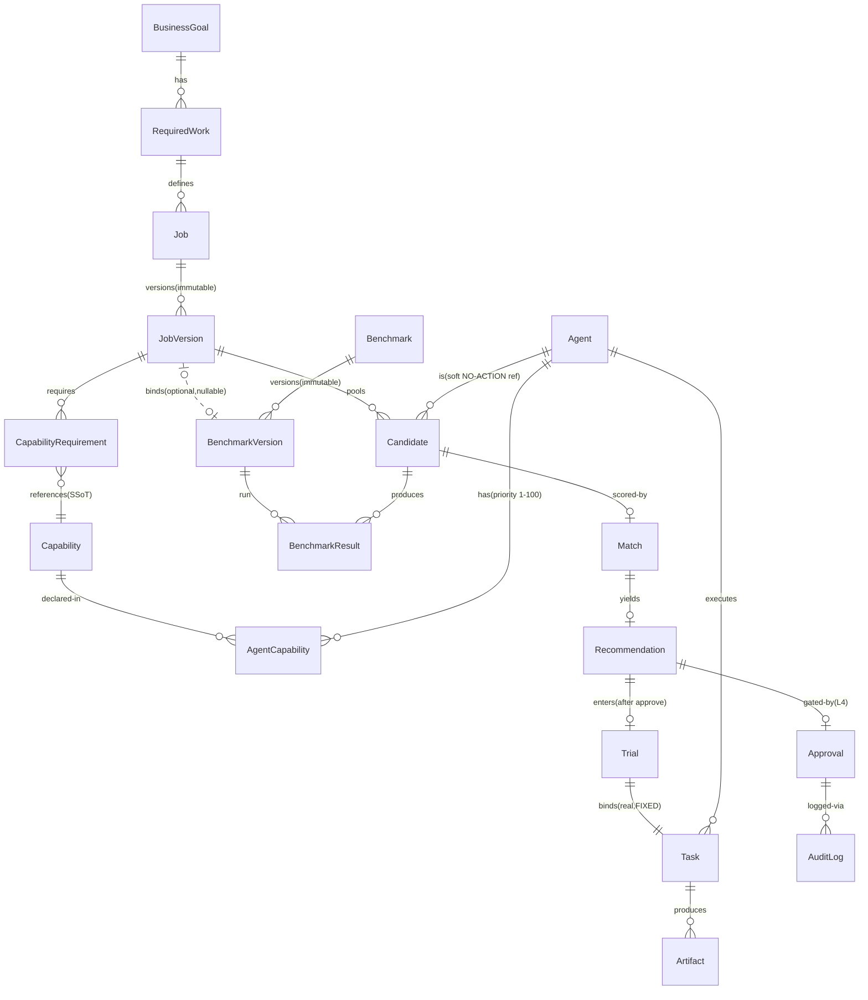

# Workforce W3 — Evaluation & Matching Spec V1

> **状态**：仅设计 / 未写代码 / 未建 migration / 未建 PR / 未 commit / 未 push。
> **事实来源**：当前主干真实代码 `aios_gap2_recover`（main tip `bf2f5c1`；W2 工作树 `fdb72d4` 与 `bf2f5c1` 字节级等同，tree `06e80ed7…`）。Alpha-1/2/3、W1、W2 均为 running code。
> **Gate 纪律**：本 Spec 通过后，实现仍需走 DSH 独立审计 + R7 对 exact-head SHA 显式授权 + AI 绝不自动 merge。
> **本轮硬约束（用户）**：只阅读 / 设计；禁止改生产代码、migration、现有测试、W1/W2 冻结语义、Alpha 架构；不实现 W3、不进 Employee/Training/Performance 代码、不进 W4。

---

## 0. 代码考古结论（当前真实状态，非历史推断）

### 0.1 已冻结的真实模型（来自代码，非提案）

| 层 | 实体 | 关键事实（file:line） | W3 关系 |
|----|------|----------------------|---------|
| Alpha-1 | `Capability` (`models.py:344`) | SSoT 能力词表，`name` unique。 | W3 只引用 `capability_id`，**不新建能力词表**。 |
| Alpha-1 | `AgentCapability` (`models.py:352`) | `(agent_id, capability_id)` PK；`priority:int 1..100`（默认50）、`enabled:bool`。**唯一可用的 capability-fit 信号**。 | W3 capability_fit 直接复用 `priority`，**不新造评分刻度**。 |
| Alpha-1 | `Agent` (`models.py:263`) | `capabilities:list[str]`(JSON,冗余镜像)、`cost_policy:dict`(不透明)、`trust_level`、`status`、`timeout_s`、`max_retries`、`limitations`、**无 reliability / benchmark / 测得的 proficiency 字段**。 | W3 只读；reliability/cost 数据缺口见 §3.4 / §3.6。 |
| W1 | `BusinessGoal`/`RequiredWork`/`Job`/`JobVersion`/`CapabilityRequirement` | `workforce.py`。Job 第一公民；JobVersion 不可变历史；`CapabilityRequirement` 引用 `capability_id`(RESTRICT FK)。 | W3 评估对象锚定 `JobVersion`。 |
| W2 | `Candidate` (`models.py:1549`) | `agent_id`(NO ACTION 软引用) × `job_id` × `job_version_id`(CASCADE) UNIQUE；`evaluation_context:JSON`（**预留给 W3，W2 恒为空 `{}`**）；`status`。 | W3 评估写入 `evaluation_context`（或见 §3.2 决策）。 |
| W2 | `CandidateStatus` (`models.py:1533`) | `POOLED`/`REJECTED` **+ 注释预留 `EVALUATING`/`EVALUATED`/`RECOMMENDED`**。 | W3 需把注释提升为真实枚举值（**受控解冻**，见 §9）。 |
| W2 | `CandidateLifecycle` (`workforce.py:393`) | `ALLOWED = {POOLED:{REJECTED}, REJECTED:{POOLED}}`；任何进入 W3 态的迁移返回 **409**。 | W3 需扩展边（**受控解冻**）。 |
| Core | `append_audit` (`audit.py:110`) | `(session, *, actor, action, resource_type, resource_id, project_id, task_id, before, after, idempotency_key)`；不可变 + 脱敏。 | W3 每步写审计，复用同一入口。 |
| Core | `delegation.check_budget(session, project, estimated_cost)` (`delegation.py:157`) | project 级 HARD-block。 | Trial 执行必须复用，不重写。 |
| Core | `delegation.make_idempotency_key(task_id, agent_id, attempt)` (`delegation.py:53`) | HMAC 幂等键。 | Trial 复用。 |
| Core | `ContextService.build_context(task_id, assignment_id)` (`context_service.py:126`) | 生成不可变 `TaskContext`（`canonical_hash`）。 | Trial 只读复用。 |
| Core | `services.create_task(...)` (`services.py:152`) | 创建 Task。 | Trial 绑定真实 Task。 |
| Core | `execute_task(session, task_id, idempotency_key, *, adapter, actor)` (`execution.py:187`) | READY→RUNNING→Artifact+provenance→task.completed。 | Trial 复用执行路径。 |
| Core | `Approval` (`models.py:495`) | `(target_artifact_id, review_policy_id, review_round, action_type)` UNIQUE gate；PENDING/APPROVED/REJECTED。 | W3 Recommendation 复用为唯一人类闸（不新造审批机制）。 |
| Core | `ReviewResult`/`ReviewPolicy` (`models.py:602/572`) | 独立评审协议。 | Trial 结果可选经 Review 入证据链。 |

### 0.2 历史设计与当前代码的关键差异（以代码为准）

提案 `aios_workforce_architecture_proposal_v1.1.md`（仓库根）把 **Evaluation + Match + Benchmark 划进 W2**、把 **Recommendation→Approval→Employee 划进 W3**。但 **实际冻结代码** 中：

- 实际 W2 只做了 **Candidate Discovery**（pool，无 evaluation/match/trial）。`workforce.py` 模块 docstring 明确："W2 (Candidate Discovery) is implemented ... as a STRICT SUBSET ... It does NOT evaluate, match, score, benchmark, or trial — those are W3+"。
- 实际 W1/W2 迁移（`20260825_0001_workforce_core`、`20260827_0001_workforce_capreq_hardening`、`20260827_0002_workforce_candidate`）**未建** `Benchmark`/`CandidateEvaluation`/`Match`/`Recommendation`/`Employee`/`Trial` 任何表。
- 实际 `schemas.py` 与 `api/app.py` **无 workforce REST 路由**（仅 `knowledge/candidates`，属 Alpha-3，与 Workforce 无关）。W3 API 为 greenfield。

**结论**：用户本轮定义的 "W3 = Evaluation & Matching" 等于提案中 "W2 后半 + W3" 的合并重定界。本 Spec 以**冻结代码为唯一事实源**重新锚定，提案仅作意图参考，凡冲突以代码为准。

### 0.3 可复用组件（W3 不重复建设）

1. `AgentCapability.priority`（1–100）—— capability fit 唯一信号。
2. `agent_registry.get_agent`（404 fail-closed）、`list_agents(capability=)`（未知 422 fail-closed）—— 候选/能力解析。
3. `delegation.check_budget` / `make_idempotency_key` —— 预算与幂等。
4. `ContextService.build_context` —— Trial 上下文。
5. `execute_task` / `services.create_task` —— Trial 真实执行。
6. `Approval`（含 `owner_inbox`）—— 唯一人类闸。
7. `append_audit` + `Idempotency-Key` —— 全部审计/幂等。
8. `ReviewResult`/`ReviewPolicy` —— 可选 Trial 评审。

---

## 1. 目标与范围

W3 V1 核心闭环（用户指定，受控不膨胀）：

```
Candidate(POOLED)
   → Evaluation(EVALUATING→EVALUATED)        # 写 evidence 到 evaluation_context
   → Benchmark(若 JobVersion 绑定 BenchmarkVersion)  # 可复现外部/内部测
   → Match / Ranking                        # capability_fit + benchmark（+可靠性/成本 仅当可测，否则 unknown）
   → Recommendation(AI 产出，需 Owner L4 Approval)
   → Trial(绑定真实 Task，执行，结果回写 Evaluation)
   → [W4: Employee 任命 —— 本 Spec 仅定义接口，不实现]
```

**本 Spec 覆盖**（§二强制清单）：Evaluation、Match/Ranking、Benchmark、Recommendation、Trial、与现有系统边界。
**本 Spec 不覆盖**（明确外推，仅定义未来接口）：Employee / Training / Performance 的实际代码——仅规定它们与 W3 的边界（§7、§9）。

---

## 2. Evaluation（评估）

### 2.1 Candidate 如何被评估
- 触发：`evaluate_candidate(session, candidate_id, *, evaluator)`。前置：`candidate.status == POOLED`（或 REJECTED→POOLED 后）。进入 `EVALUATING`。
- 评估内容（证据，写入 `Candidate.evaluation_context`，**复用 W2 预留 JSON 包，W3 V1 不新建 `CandidateEvaluation` 表**——避免膨胀；若该包过大再于后续阶段拆表）：
  - `capability_evidence`：对 `JobVersion` 的每个 `CapabilityRequirement`，取 `AgentCapability.priority`（经 `agent_registry` 解析）对照 `min_proficiency`，产出 `fit` 明细（见 §5 公式）。
  - `benchmark_evidence`：若 `JobVersion` 绑定 `BenchmarkVersion`，则跑该 benchmark，写入 `benchmark_result_id` 列表（见 §4）。
  - `cost_evidence`：读 `Agent.cost_policy`（若可解析），否则 `status: "opaque_schema"`。
  - `reliability_evidence`：`status: "future_capability"`（**当前无数据，禁止虚构**，见 §3.4）。
  - `historical_evidence`：`status: "future_capability"`（Employee 级数据，W3 无，见 §3.6）。
- 完成：状态 `EVALUATED`，`evaluation_context.evaluated_at`、`evaluator`、`evaluated_fields`（实际算出的组件列表，用于可解释性）。

### 2.2 Capability evidence 来源
- 唯一来源：`AgentCapability`（Alpha-1 SSoT）。经 `agent_registry` 解析，绝不读 `Agent.capabilities` JSON 镜像（那只是冗余展示字段）。
- 解析失败（agent 未声明某 required capability 或 `enabled=False`）→ fit=0 → **fail-closed**（见 §2.5）。

### 2.3 Benchmark result
- 由 §4 的 `BenchmarkResult` 承载；`evaluation_context.benchmark_evidence` 存 `benchmark_result_id[]` 引用，不内联大结果（保持 `evaluation_context` 小巧、可审计）。

### 2.4 Evaluation 状态机
```
POOLED ──evaluate──▶ EVALUATING ──done──▶ EVALUATED
 EVALUATED ──reject──▶ REJECTED ──repool──▶ POOLED
 EVALUATED ──recommend──▶ RECOMMENDED   (需先有 Match，见 §3)
```
- 进入 `EVALUATING` 必须自 `POOLED`（或 REJECTED 经 repool）。自 `REJECTED` 直接进入 `EVALUATING` 非法 → 409。
- `EVALUATING` 为进行中态；若评估失败（如 benchmark 执行异常），回退 `POOLED` 并记录 `evaluation_error`，**绝不停留在半状态**。

### 2.5 fail-closed 规则（硬约束）
- **F1**：任一 *required* 的 `CapabilityRequirement` 的 `fit` 不达标（priority < min_proficiency）→ 该 Candidate **不可**进入 `RECOMMENDED`，强制停留 `EVALUATED` 并置 `recommendation_blocked_reason="capability_gap"`。
- **F2**：若 `JobVersion` 绑定了 `BenchmarkVersion` 但 benchmark 执行产生不可信结果（缺失输出/校验失败）→ 评估失败回退，不写入假成绩。
- **F3**：`reliability`/`historical` 缺失时，**不得**用占位值（如 0.5）参与最终是否推荐的判定；它们只能以 `unknown` 标注，且**不得**成为 required 输入（见 §5.3）。
- **F4**：`evaluation_context` 写入须在 `append_audit` 同事务内；审计 `before/after` 至少含 `status` 与 `evaluated_fields`。

---

## 3. Match / Ranking（匹配与排序）

### 3.1 Candidate → Match Score
- `compute_match(session, candidate_id)`：读取 `evaluation_context`，按 §5 公式产出 `Match` 记录（与 `Candidate` 分离，便于不改评估即可重排）。
- `Match` 字段：`candidate_id`、`job_version_id`、`score:float`、`breakdown:JSON`（各组件子分+来源+证据引用）、`evaluated_fields:list[str]`、`evidence_refs:list[str]`（benchmark_result_id 等）、`created_at`。

### 3.2 评分维度（与用户清单一一对应）
1. **capability fit** —— 永远可算（来自 SSoT）。
2. **benchmark performance** —— 仅当 `JobVersion` 绑定 `BenchmarkVersion` 时必算；否则 `unknown` 且 **waived**（不阻塞）。
3. **reliability** —— FUTURE 能力（§3.4），V1 仅 `unknown`，**不参与**是否推荐。
4. **cost** —— 仅当 `Agent.cost_policy` 可解析时计算，否则 `unknown`；V1 为 **advisory**（§3.6）。
5. **historical performance** —— FUTURE 能力（Employee 级），V1 标记 `future_capability`，**不进入评分**。

### 3.3 score 可解释 / 可审计（硬要求）
- `score` **绝不**是单点黑盒数。`breakdown` 必须逐组件给出：`{component, value|null, status: computed|unknown|advisory, source:[ids], method}`。
- `evidence_refs` 指向 `BenchmarkResult.id` 等不可变记录，任何下游可复算/复核。
- 权重与公式集中为**单一版本常量** `MATCH_WEIGHTS_V1`（文档化于本 Spec §5，不散落魔法数）。
- 每次 `compute_match` 写审计：`action="match.computed"`，`after` 含 `score`+`evaluated_fields`。

### 3.4 reliability —— 明确为后续能力（不虚构）
- **当前代码无 reliability 数据**：`Agent` 仅有 `trust_level`/`status`/`timeout_s`/`max_retries`，无成功率/可用性时序。
- **W3 V1 决策**：`reliability` 维度以 `status:"future_capability"` 表现，**禁止**用 `trust_level` 等近似冒充 reliability 分数。真正 reliability 需 Employee/Training/Performance（W4+）回流，届时再定义采集口径。**不得**为凑齐评分而伪造。

### 3.5 Ranking
- `rank_candidates(session, job_version_id)`：取该 `job_version` 下所有 `EVALUATED`（或 `RECOMMENDED`）候选，按 `Match.score` 降序，tie-break：`capability_fit` → `benchmark_score`(若) → `agent_id`。
- 仅 `score` 完整（所有 required 组件 computed）的候选参与排名；有 `recommendation_blocked_reason` 的候选被排除并标注。

### 3.6 cost —— advisory only（不阻塞）
- `Agent.cost_policy` 是**不透明 dict，schema 未定义**（代码无解析约定）。W3 V1 **不**为它定义 schema（schema 归 W5 Budget 域）。
- 若 `cost_policy` 可读且含单位成本，则计算 `cost_score` 作 **advisory** 展示；否则 `unknown`。**cost 不得成为推荐门槛**。

---

## 4. Benchmark（基准）

### 4.1 Benchmark 如何定义
三表（均 additive，单 head）：
- `benchmark`：复用/定义考试模板。`id`、`name`、`description`、`owner`、`created_at`。
- `benchmark_version`：不可变版本。`id`、`benchmark_id`、`version:int`、`definition_json`（cases 的不可变快照：输入、期望产出形态、评分 rubric）、`created_at`。`(benchmark_id, version)` UNIQUE。
- `benchmark_case`：可选细粒度 case（若 V1 仅 version 级总分，可后置；默认 V1 用 `definition_json` 内含 cases，不强制独立表——**避免膨胀**，见 §4.5）。

### 4.2 如何绑定 Job / JobVersion / CapabilityRequirement
- `JobVersion` 增加 **可选** 字段 `benchmark_version_id`（FK→`benchmark_version.id`，nullable，CASCADE）。W3 V1 通过 `add_benchmark_binding(job_version_id, benchmark_version_id)` 绑定，**仅在 head version 可绑**，历史版本不可变（沿用 W1 不变历史原则）。
- 不绑定则 Benchmark 维度 waived（§3.2）。
- `CapabilityRequirement` **不**直接绑 benchmark（benchmark 是岗位级，非单能力级）——与提案 §11 Q3 的"仅 version 级总分"取一致，保持简单。

### 4.3 如何记录结果
- `benchmark_result`：`id`、`candidate_id`、`benchmark_version_id`、`passed_cases:int`、`total_cases:int`、`quality_score:float|null`、`input_hash`、`output_ref`、`agent_snapshot_json`（执行时 agent 能力/版本快照）、`environment`、`created_at`、`evaluator`。
- 结果存 `benchmark_result` 表（非内联进 `evaluation_context`），`evaluation_context.benchmark_evidence` 仅存引用。

### 4.4 如何保证可复现
- **可复现 ≠ bit-exact**（LLM Agent 本质非确定）。定义 `reproducibility_hash = H(benchmark_version_id, case_set_hash, agent_id, agent_capability_snapshot, input_hash)`。
- 重跑同 `reproducibility_hash` 须得到**可比较**结果；系统记录每次 run 的 `agent_snapshot_json`+`environment`，使结果可复核、可定位漂移。
- `benchmark_version.definition_json` 不可变；绑定后换 benchmark 必须**新绑 version**（不 mutate 旧绑定）。

### 4.5 与 ai-arena 等外部 benchmark 的接口边界
- 定义抽象 seam `BenchmarkAdapter`（Protocol）：`run(candidate, benchmark_version) -> BenchmarkResult`。
- **W3 V1 不实现 ai-arena 适配器**（属 P2/外部集成）。仅定义接口与"结果如何落 `benchmark_result`"的契约；具体 adapter 留待后续阶段，且不得反向依赖 Workforce 核心。
- 内部 benchmark（确定性脚本/pytest 风格）可在 V1 实现；外部 LLM 对抗式 benchmark（如 ai-arena）仅留接口。

---

## 5. 评分公式与解释性要求

### 5.1 组件计算
- **capability_fit**（0..1，永远可算）：
  - 对 `JobVersion` 的每个 `CapabilityRequirement` `r`（取 `required=True` 为硬门槛，`required=False` 为加分项）：
    - `p = AgentCapability.priority(agent, r.capability_id)`；未声明/`enabled=False` → `p = 0`。
    - 硬门槛：`p >= r.min_proficiency` 否则 **fail-closed**（F1）。
    - `fit_i = clamp((p - r.min_proficiency) / (100 - r.min_proficiency), 0, 1)`。
  - `capability_fit = mean(fit_i over required reqs)`；preferred reqs 以权重 `w_pref` 微量加成（≤5%，不喧宾夺主）。
- **benchmark_score**（0..1 或 null）：`passed_cases / total_cases`（可加权 quality）；未绑 → null（waived）。
- **reliability_score**：null，`status=future_capability`。
- **cost_score**：null 或 advisory（见 §3.6）。
- **historical_score**：null，`status=future_capability`。

### 5.2 聚合（版本化常量 `MATCH_WEIGHTS_V1`）
```
required_present = [capability_fit] + ([benchmark_score] if bound else [])
score = Σ (w_k * component_k) / Σ w_k      # 仅对 "computed" 组件归一
```
- V1 建议权重：`capability_fit=0.6`，`benchmark_score=0.4`（若 bound）；若未绑 benchmark，则 `capability_fit=1.0`（单组件归一）。
- `reliability`/`cost`/`historical` **不进入分母**（它们为 unknown/advisory，避免污染）。

### 5.3 fail-closed 与可解释性落地
- `RECOMMENDED` 前置：`capability_fit` 硬门槛过 **且** 所有 *required* 组件 computed（capability_fit 恒 computed；benchmark 若 bound 必 computed）。
- 任何 required 组件 unknown → 拒绝推荐，置 `recommendation_blocked_reason`，**不产出虚假高分**。
- `Match.breakdown` + `evidence_refs` 强制审计；下游可逐组件复核。

---

## 6. Recommendation（推荐）

### 6.1 Candidate → Recommended 的条件
- 仅当 `compute_match` 通过 §5.3 门槛（无 `recommendation_blocked_reason`）→ `recommend_candidate(session, candidate_id)` 置 `RECOMMENDED`，生成 `Recommendation` 记录。
- `Recommendation`：`id`、`match_id`、`candidate_id`、`job_version_id`、`proposed_action`（V1 仅 `"hire"` 有效；`replace/promote/transfer/terminate` 为占位，W4+ 启用）、`target_employee_id`（V1 恒 null，Employee 在 W4）、`rationale`、`created_at`、`status: PROPOSED`。

### 6.2 决策权
- **AI 仅产出 Recommendation**（proposed_action + rationale）。**AI 不得**自主 hire/fire/replace/改高风险 permission/提 budget（沿用提案硬边界）。
- **唯一人类闸 = Owner L4 Approval**（复用 `Approval` + `owner_inbox`，**不新造审批机制**）。

### 6.3 是否需要 Approval
- **是，强制**。Recommendation(PROPOSED) → 创建 `Approval`（action_type=`workforce.recommend`，绑定 recommendation_id）→ Owner 在 `owner_inbox` 批准/驳回。
- Approval APPROVED 后方可进入 Trial（单一人类闸，见 §7）。

### 6.4 审计要求
- Recommendation 创建：`action="recommendation.proposed"`，`after` 含 `match_id`/`proposed_action`/`score`。
- Approval 决策：`action="recommendation.approval"`，`after` 含 decision + recommendation_id（复用 `Approval` 既有审计）。
- 所有写操作带 `idempotency_key`（如 `recommend:{candidate_id}:{job_version_id}`、`approval:{recommendation_id}`），保证重放幂等。

---

## 7. Trial（试用）

### 7.1 推荐后如何进入 Trial
- 仅 `RECOMMENDED` + Approval APPROVED 的候选可建 Trial。
- `create_trial(session, recommendation_id)`：
  1. 校验 Recommendation 状态 + 对应 Approval APPROVED（fail-closed 否则 409）。
  2. 经 `services.create_task(...)` 建一个**真实 Task**（project 取自 Job 所属 `BusinessGoal`→`Project` 或新建项目；`required_capabilities` 取自 JobVersion 的 `capability_name` 列表，`assigned_agent_id = candidate.agent_id`，`routing_mode=FIXED`）。
  3. `Trial`：`id`、`recommendation_id`、`candidate_id`、`task_id`、`status: CREATED`、`created_at`。
  4. 写审计 `action="trial.created"`。

### 7.2 与 Execution / Budget / Artifact / Review 的关系
- **Execution**：经 `execute_task(session, task_id, idempotency_key, adapter=, actor=)` 真实执行（复用既有 READY→RUNNING→Artifact 路径），**不重写**。
- **Budget**：执行前必须经 `delegation.check_budget(session, project, estimated_cost)`（project 级 HARD-block）；Trial 成本如实计入 `Project.budget_used`。**W3 不自定义预算**。
- **Artifact**：执行产出 `Artifact`（含 provenance），可作 Trial 证据。
- **Review（可选）**：若 Job 配置 `ReviewPolicy`，Trial Artifact 可走独立评审 `ReviewResult`，评审分写入 Trial 证据。

### 7.3 Trial 状态机与回写 Evaluation
```
CREATED ──execute──▶ RUNNING ──done──▶ PASSED | FAILED
```
- 成功：Trial `status=PASSED`，`result_artifact_id`、`review_score?` 写入 `Candidate.evaluation_context.trial = {passed:true, artifact_id, review_score?}`。
- 失败：Trial `status=FAILED`，`trial={passed:false, error}`，候选**不自动 reject**；可回 `EVALUATED` 重新评估或 `REJECTED`（由 Owner/后续阶段决定，W3 不自动 hire/fire）。
- **回写语义**：Trial 结果增强 `evaluation_context` 的置信证据；V1 中它**不修改** `Match.score` 的 reliability 分量（reliability 仍是 future_capability），但 `breakdown` 可附 `trial_passed` 供人类参考。真正的 reliability 回流归 W4+。

---

## 8. 与现有系统的边界（硬约束）

| 系统 | W3 关系 | 允许 / 禁止 |
|------|---------|------------|
| Agent Registry (`agent_registry`) | 只读消费 `get_agent`/`list_agents` | ✅ 读；❌ 写 registry、❌ 改 `AgentCapability.priority` 语义 |
| Capability SSoT (`Capability`) | 仅引用 `capability_id` | ✅ 引用；❌ 新建能力词表 |
| TaskContext (Alpha-2) | Trial 经 `ContextService.build_context` 只读复用 | ✅ 读；❌ 重算/重建 |
| Scheduler (`scheduler.route_task`) | Trial 用 `FIXED` 直绑候选 agent；可 query `route_task` 作 hint | ✅ query；❌ 接管调度 |
| Execution (`execute_task`) | Trial 复用执行路径 | ✅ 复用；❌ 改写 |
| Budget (`delegation.check_budget`) | Trial 复用 HARD-block | ✅ 复用；❌ 自造预算 |
| Knowledge (Alpha-3) | 不写 Knowledge；benchmark 证据**不**自动提为 KnowledgeFact | ✅ 隔离；❌ 越界提交 |
| Audit / Idempotency (`append_audit`) | 全部写经此入口 + `Idempotency-Key` | ✅ 复用；❌ 新造机制 |
| Approval (`Approval`/`owner_inbox`) | 唯一人类闸 | ✅ 复用；❌ 新造审批 |
| Employee / Training / Performance | **仅定义接口边界**（见 §9），不实现 | ✅ 接口；❌ 本阶段代码 |

**反向依赖禁令**：Core 域任何模块（含 Alpha-1/2/3、Scheduler、Execution、Budget）**不得 import / 依赖 workforce**。Workforce 单向调用 Core 的已存在 API。

---

## 9. Migration Strategy（仅设计，不执行）

### 9.1 必须解冻（受控，非违反冻结语义）
1. **`CandidateStatus` 枚举**：将注释的 `EVALUATING`/`EVALUATED`/`RECOMMENDED` 提升为真实成员（W2 注释本就是为 W3 预留）。
2. **`CandidateLifecycle.ALLOWED`**（`workforce.py:403`）：扩展边
   `POOLED→{REJECTED, EVALUATING}`、`EVALUATING→{EVALUATED, POOLED}`、`EVALUATED→{RECOMMENDED, REJECTED}`、`RECOMMENDED→{TRIAL, REJECTED}`（TRIAL 态如纳入 Candidate 则加；否则 Trial 独立表）。
3. **既有 W2 契约测试 `test_candidate_illegal_transition_rejected_409`**（`tests/test_workforce_models.py:553`）：该测试断言"W3 态不可进入"。W3 实现 PR 须同步更新此测试以允许新合法边（属受控测试变更，列入实现清单）。

### 9.2 新建表（additive，单 head，可逆）
- `benchmark`、`benchmark_version`、`benchmark_result`
- `match`、`recommendation`、`trial`
- `JobVersion` 加 nullable `benchmark_version_id` 列（CASCADE FK）
- **不新建** `CandidateEvaluation` 表（V1 复用 `Candidate.evaluation_context` JSON，防膨胀）
- **不新建** `Employee`/`Training`/`PerformanceSnapshot` 表（W4+）

### 9.3 迁移纪律
- 全部 additive，保持 alembic 单 head；每个迁移 `downgrade` 完整可逆。
- 不碰 W1 表语义、W2 `candidate` 表结构（`evaluation_context` 仅写值不改性）、Alpha 迁移。

### 9.4 Employee / Training / Performance 的未来接口边界（仅声明）
- `Employee.agent_id = Candidate.agent_id`、`job_id`、`job_version_id`、`appointment_approval_id`（幂等锚点，V1 不建）。
- W4 Approval 处理函数内同事务创建 Employee（复用本 Spec 的 Approval 锚点），保证"批准即落地、杜绝半状态"。
- `PerformanceSnapshot` 只读聚合现有 Task/Execution/Audit 数据，不新建平行执行记录。
- Training 仅经 `knowledge_service.submit_candidate` 喂数据，不反向依赖。

---

## 10. Test / Gate Plan（设计，不执行）

### 10.1 契约测试（实现阶段须全绿）
- **T-EVAL-1**：`evaluate_candidate` 自 `POOLED` 进入 `EVALUATING→EVALUATED`，`evaluation_context` 含 `capability_evidence`。
- **T-EVAL-2（fail-closed）**：required capability `priority < min_proficiency` → 候选滞留 `EVALUATED`，`recommendation_blocked_reason="capability_gap"`，不可 `RECOMMENDED`。
- **T-EVAL-3**：`EVALUATING` 中 benchmark 异常 → 回退 `POOLED` + `evaluation_error`，无半状态。
- **T-MATCH-1**：`compute_match` 产出 `breakdown` + `evidence_refs` + `evaluated_fields`；`score` 可复算。
- **T-MATCH-2（不虚构）**：`reliability`/`historical` 恒 `unknown`，**不**进入 score 分母；cost 为 advisory 不阻塞。
- **T-BENCH-1**：`benchmark_version.definition_json` 不可变；绑定后换 benchmark 须新 version。
- **T-BENCH-2**：`reproducibility_hash` 同输入重跑可比较；`agent_snapshot_json` 持久。
- **T-REC-1**：仅 `capability_fit` 硬门槛过 + 必算组件齐全 → 可 `RECOMMENDED`；否则拒绝。
- **T-REC-2**：Recommendation 必须配套 `Approval`；无 Approval 不得建 Trial（409）。
- **T-TRIAL-1**：`create_trial` 复用 `create_task`+`FIXED`+`check_budget`；执行经 `execute_task` 产 Artifact。
- **T-TRIAL-2**：Trial 成功/失败回写 `evaluation_context.trial`；失败不自动 reject。
- **T-IDEM-1**：evaluate / match / recommend / trial 均幂等（重放同 `idempotency_key` 不重复副作用）。
- **T-AUDIT-1**：每步 `append_audit` 记录 `before/after`+`idempotency_key`，脱敏生效。
- **回归**：Alpha-1/2/3、W1、W2 既有测试全绿；alembic 单 head。

### 10.2 Gate（实现阶段）
DSH 独立审计（路径③自包含 prompt：exact-head SHA + 7 契约 A–G：alembic 单 head 不可变 / 状态机边界 / downgrade 完整 / SSoT 不新能力词表 / 测试断言 / fail-closed 语义 / 可解释 score 审计）+ R7 对 exact-head SHA 显式授权 + AI 绝不自动 merge。

---

## 11. 必须解冻 / 不解冻 / 风险

### 11.1 必须解冻（受控）
- `CandidateStatus` 提升 `EVALUATING`/`EVALUATED`/`RECOMMENDED` 为真实枚举（W2 预留）。
- `CandidateLifecycle` 扩展合法迁移边。
- 更新 `test_candidate_illegal_transition_rejected_409` 以允许新边。
- `JobVersion` 加 nullable `benchmark_version_id`。

### 11.2 明确不解冻 / 不碰
- W1 Job/JobVersion/CapabilityRequirement 语义与 RESTRICT FK。
- W2 `discover_candidates` 幂等/并发逻辑与 `evaluation_context` 字段结构。
- Agent Registry / `Capability` SSoT / `AgentCapability.priority` 语义。
- Alpha-1/2/3 架构与机制。
- Scheduler / Execution / Budget / Knowledge / Context 机制（仅复用）。
- 不新建能力词表、不新建 Employee/Training/Performance 表、不实现 ai-arena 适配器。

### 11.3 风险
- **P0-1（可复现性）**：LLM Agent 非确定 → benchmark 非 bit-exact。缓解：记录 `reproducibility_hash`+`agent_snapshot`+`environment`，定义"可比较"而非"逐字节相同"；评测以多次取稳定值为准。
- **P0-2（fail-closed 防虚构）**：可靠性/历史无数据，易诱使填占位值。缓解：§2.5 F3 + §5.3 强制 `unknown` 不入围；CI 测试 T-MATCH-2 拦截。
- **P0-3（幂等）**：evaluate/match/recommend/trial 重放副作用。缓解：全链路 `idempotency_key` + UNIQUE/存在性检查（沿用 W2 SAVEPOINT 吸收并发模式）。
- **P1-1（benchmark 绑定不可变）**：换 benchmark 须新 version，防历史评估失真。
- **P1-2（预算）**：Trial 必须走 `check_budget`，防超支；成本如实计入 project。
- **P2-1（cost 不透明）**：`Agent.cost_policy` schema 未定义 → V1 cost 仅 advisory；schema 归 W5 Budget 域。
- **P2-2（外部 benchmark）**：ai-arena 等适配器留接口不实现，防范围蔓延。

---

## 12. 待 R7 拍板的问题（Open Questions）

1. **Benchmark 粒度**：V1 用 `benchmark_version.definition_json` 内含 cases（version 级总分），还是必须独立 `benchmark_case` 表？本 Spec 默认前者以节流。
2. **Trial 的 Project 归属**：Trial Task 挂到哪个 `Project`？（Job→BusinessGoal→Project 链路当前未建；可能需新建轻量 Project 或允许 Trial 自带 project_id）。需定。
3. **reliability 采集触发点**：确认 reliability 数据在 W4（Employee 任命后）才回流，V1 恒 `unknown`。确认无更早可用信号。
4. **Recommendation 的 proposed_action 范围**：V1 是否仅 `"hire"`，`replace/promote/...` 纯占位？确认。
5. **cost_policy 是否需在 W3 定义最小 schema**：若要让 cost 成为 scored（非 advisory），需在 W5 前先定 `cost_policy` 结构；V1 维持 advisory。

---

## 13. W3 Spec Gate 判定

### 判定：**GO WITH CONDITIONS**

**理由**：设计完整覆盖用户强制清单（Evaluation / Match / Benchmark / Recommendation / Trial + 边界 + 状态机 + 接口契约 + 评分公式 + 审计/幂等/fail-closed + 迁移策略 + 测试/Gate + 解冻/不解冻/风险），且严格复用既有基础设施（Capability SSoT、AgentCapability.priority、Scheduler/Execution/Budget/Audit/Approval），未重复建设、未膨胀进 Employee/Training/Performance。架构闭环清晰、fail-closed 防虚构机制到位。

**GO 的前提条件（Conditions，须 R7 确认）**：
1.  sanction 受控解冻 `CandidateStatus`/`CandidateLifecycle`（W2 注释本就预留，非违规）。
2.  接受"不虚构评分"铁律：reliability/historical 为 future_capability，V1 不得合成；cost 仅 advisory。
3.  接受 benchmark 可复现定义为"可比较、记录溯源"而非 bit-exact。
4.  确认 W3 边界止于 Trial+回写；Employee 任命（含 Appointment 原子创建）归 W4。
5.  确认 Recommendation→Approval(L4) 为唯一人类闸，Trial 须经其批准方可建。
6.  确认更新 `test_candidate_illegal_transition_rejected_409` 为 W3 实现 PR 的受控测试变更。

条件达成即为 **GO**；上述任一项存疑则降为 **NO-GO** 直至澄清。P0 风险（可复现性 / 防虚构 / 幂等）已在测试中设闸，不阻断 GO。

---
*本文件为设计产物，未修改任何代码 / migration / 测试，未 commit / push / PR。实现须另起 gate 流程。*

## 附录 A：ER 关系图（Mermaid）



> 实线=强引用（CASCADE/RESTRICT FK）；虚线=`nullable`/`NO ACTION` 软引用。Workforce 单向调用 Core（Registry/Capability/Scheduler/Execution/Budget/Knowledge/Context/Audit/Approval），反向依赖禁止。新表仅 `benchmark`/`benchmark_version`/`benchmark_result`/`match`/`recommendation`/`trial`（加 `JobVersion.benchmark_version_id` 列）；**不建** `CandidateEvaluation`/`Employee`/`Training`/`PerformanceSnapshot`。
