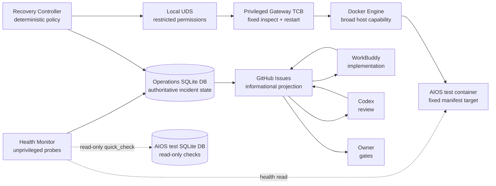
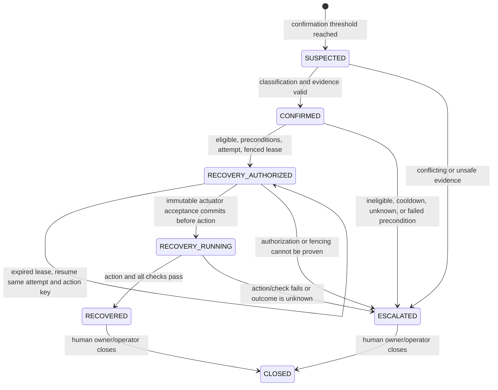

# AIOS Limited Self-Healing Operations V1 Design

## 1. Decision and scope

AIOS Operations V1 is an external, deterministic watchdog for the AIOS **test**
environment. It detects incidents, persists evidence in its own durable store,
and may execute one fixed recovery runbook: restart the AIOS test application
process once.

WorkBuddy owns routine diagnosis and implementation. Codex independently reviews
changes and operational evidence. The owner retains merge, credentials, cost,
real-model-call, and every production decision.

V1 does not add an AIOS business service, model, migration, workflow, routing
rule, or UI. It does not use an LLM to classify incidents or choose recovery.
Production recovery is entirely out of scope. Passing V1 may qualify the system
only for a separately approved production **read-only monitoring** design.

## 2. Trust boundaries, threat assumptions, and components



The components are:

- **Health Monitor**: collects bounded observations and applies fixed
  confirmation rules.
- **Recovery Controller**: advances the incident state machine, acquires a
  fenced lease, validates preconditions, and requests the one allowed runbook.
- **Process-Control Gateway**: a privileged trusted-computing-base component and
  the only process with Docker access. It exposes only one fixed inspect/restart
  protocol over a local Unix-domain socket. It is not a generic Docker wrapper.
- **Operations Store**: a separate SQLite database and the authoritative source
  for incident execution state. No operations state is written into the AIOS
  application database.
- **GitHub Outbox Worker**: delivers sanitized informational projections and
  handoffs idempotently. GitHub labels never authorize or drive execution.

V1 threat assumptions are explicit:

- the fixed Linux test host, root-owned deployment manifest, Docker daemon,
  operations DB host permissions, and reviewed Gateway binary/configuration form
  the trusted computing base;
- the Recovery Controller, GitHub content, application responses, probe text,
  and all caller-supplied payloads are untrusted for target selection;
- compromise of the Docker daemon, host root, or Gateway TCB is outside V1's
  containment guarantee and requires host-level incident response;
- the controller does not possess a Docker socket, shell, SSH, service-manager
  administrative interface, AIOS mutation credential, or production credential.

Gateway model A is selected. The Gateway:

- listens only on a local Unix-domain socket at a fixed root-owned path with
  restrictive owner/group permissions; it has no TCP listener;
- accepts no caller-provided host, container name/ID, image, command, URL, or
  Docker operation; the request contains only validated incident, attempt,
  action-key, runbook, and fencing identifiers;
- loads the fixed target only from the root-owned manifest and independently
  verifies container labels, image digest, and Git commit using Docker inspect;
- implements only the exact inspect fields and fixed restart call required by
  V1, with no shell, exec, arbitrary HTTP forwarding, or generic Docker API;
- has no external network access and runs with a read-only filesystem, bounded
  writable state, dropped nonessential Linux capabilities, `no-new-privileges`,
  a default-deny seccomp profile, and an AppArmor profile or documented platform
  equivalent;
- requires dedicated endpoint-permission, malformed-request, target-substitution,
  forbidden-Docker-operation, sandbox, and privilege-boundary tests plus Codex
  security review on the exact implementation head.

Because Docker socket access is broadly privileged, V1 does not claim native
Docker least privilege. Safety depends on the small reviewed Gateway TCB and the
controls above.

## 3. Supported deployment topology and trusted target

V1 supports one Linux-only topology: one fixed Linux test host running the
controller, Gateway, Docker Engine, and target container. Windows hosts and named
pipes are not supported in V1; either requires a separate future security design
and dedicated test suite.

- environment ID: `aios-test`;
- host ID: the one fixed Linux test host, recorded in a root-owned deployment manifest;
- application component ID: `aios-test-app`;
- runtime: one Docker container on the fixed test host;
- required container name: `aios-test-app`;
- required labels:
  - `com.aios.environment=test`;
  - `com.aios.component=application`;
  - `com.aios.git-sha=<expected immutable commit>`;
- expected immutable image digest;
- controller-to-Gateway transport: Unix-domain socket only, at the fixed
  root-owned path and reachable only by the recovery controller;
- AIOS database path: a configured, canonical test-only path opened read-only by
  the health monitor.

The trusted deployed-version source is a root-owned, read-only manifest at a
fixed host path. The manifest contains schema version, environment ID, host ID,
component ID, container name, image digest, Git commit, and required labels. The
operations user cannot modify it. When the application is unavailable, the
Health Monitor and Process-Control Gateway obtain deployed-version evidence from
this manifest plus Docker inspect; they never depend on the application's own
version response.

Before accepting an action, the gateway verifies all of these fixed values:

- current host ID equals the manifest host ID;
- container name is exactly `aios-test-app`;
- environment and component labels match exactly;
- container image ID equals the manifest image digest;
- Git SHA label equals the manifest Git commit;
- no second container satisfies or conflicts with the target identity.

If the manifest is absent, writable by the operations identity, stale,
ambiguous, or inconsistent with Docker inspect, recovery is disabled and the
incident is escalated. Production endpoints and containers are technically
unreachable to the recovery credential, not merely excluded by convention.

## 4. Incident identity and deduplication

### 4.1 Fingerprint

An incident fingerprint is:

```text
sha256(
  "ops-incident/v1" + "\n" +
  environment_id + "\n" +
  check_type + "\n" +
  affected_component + "\n" +
  normalized_failure_classification + "\n" +
  deployed_version_or_dash
)
```

All fields are normalized UTF-8 NFC, trimmed, lower-case ASCII identifiers from
versioned enums. Timestamps, raw messages, stack traces, and random values never
participate in identity.

`deployed_version_or_dash` is the immutable image digest or Git commit for
deployment-sensitive checks and `-` otherwise.

### 4.2 Observation and incident behavior

- Every probe result is stored as an `observation`.
- A transient failed observation does not create an incident.
- When a probe's confirmation threshold is met, one incident is created with
  the deterministic fingerprint and a generated immutable incident ID.
- A partial unique index permits at most one active, nonterminal incident
  (`SUSPECTED` through `RECOVERY_RUNNING`) for a fingerprint. Terminal
  `RECOVERED`, `ESCALATED`, and `CLOSED` history may coexist with a later
  incident.
- Concurrent confirmations converge on the existing incident after a unique
  conflict; they append observations and do not create a second incident.
- Duplicate observations use a deterministic observation idempotency key based
  on probe source, scheduled probe slot, check type, and component.

### 4.3 Terminal incidents, new incidents, and cooldown

- `RECOVERED`, `ESCALATED`, and `CLOSED` incidents are terminal for automation.
  They never reopen and never return to a recovery state.
- Duplicate delivery or process replay for an existing incident reuses its
  incident ID, attempt ID, action key, and GitHub marker.
- After an incident becomes terminal, a later failure that independently meets
  the confirmation threshold creates a new incident ID, even when its
  fingerprint is identical. It links `previous_incident_id`.
- Automatic restart eligibility is additionally controlled by a durable
  runbook cooldown guard keyed by
  `(environment_id, component_id, runbook_id)`. The guard is independent of
  incident state and GitHub Issue state.
- The restart guard is set atomically when the Process-Control Gateway accepts
  the action and sets `blocked_until_utc = action_accepted_at_utc + 30 minutes`.
- Human transition to `CLOSED` and human Issue closure never remove, shorten, or
  bypass the guard.
- A new confirmed incident during cooldown is persisted with new evidence and
  transitions to `ESCALATED` with reason `RUNBOOK_COOLDOWN_ACTIVE`; it performs
  zero automatic actions.
- After cooldown, a new confirmed eligible incident may follow the normal
  authorization path.

## 5. Incident state machine



### 5.1 Transition contract

| Transition | Trigger | Allowed actor | Required persisted evidence | Idempotency and crash behavior |
|---|---|---|---|---|
| observations -> `SUSPECTED` | Probe confirmation threshold met | Health Monitor | Observation IDs, fingerprint inputs, threshold/policy version | Unique active fingerprint converges concurrent creators. Crash before commit creates no incident; probes replay. |
| `SUSPECTED -> CONFIRMED` | One unambiguous normalized classification | Health Monitor classifier | Classification, component, trusted deployed version, supporting observation IDs | Compare-and-swap on state/version. Replay returns existing state. |
| `SUSPECTED -> ESCALATED` | Conflicting observations, unknown class, unsafe target | Health Monitor classifier | Conflict/unknown reason and bounded observation references | Terminal for automation. Replay only appends evidence. |
| `CONFIRMED -> RECOVERY_AUTHORIZED` | Classification is exactly `TEST_APP_UNRESPONSIVE`; all preconditions pass; cooldown clear; initial GitHub delivery acknowledged; lease acquired | Recovery Controller | Runbook/version, deterministic action key, the single attempt ID, preconditions, lease owner, fencing token, UTC authorization/expiry | Atomic transaction creates at most one attempt per incident. Existing attempt/action key is reused. |
| `CONFIRMED -> ESCALATED` | Ineligible class, active cooldown, failed precondition, GitHub unavailable, target/clock ambiguity | Recovery Controller | Eligibility/precondition/cooldown failure and escalation reason | Terminal for automation. |
| `RECOVERY_AUTHORIZED -> RECOVERY_AUTHORIZED` | Previous lease expired before actuator acceptance | New Recovery Controller | New lease and fencing token; existing attempt ID/action key; proof no actuator acceptance exists | Compare-and-swap updates the existing attempt to the new fencing token only while its lifecycle is `AUTHORIZED`. No second attempt/action key. |
| `RECOVERY_AUTHORIZED -> RECOVERY_RUNNING` | Gateway validates current fence, atomically commits immutable actuator acceptance and cooldown, then invokes the fixed action | Recovery Controller plus Gateway | Attempt ID, action key, fencing token, fixed target, acceptance ID, `action_accepted_at_utc` | Acceptance and cooldown are unique. Once acceptance exists, the Gateway can never invoke the action again. |
| `RECOVERY_AUTHORIZED -> ESCALATED` | Missing attempt, ambiguous acceptance/outcome state, gateway/fence rejection, or authorization cannot be proven | Recovery Controller/reconciler | Stable failure reason and existing attempt/acceptance/outcome references | No action may subsequently start for this incident. |
| `RECOVERY_RUNNING -> RECOVERED` | Restart succeeds; liveness, trusted version, DB readability, and DB quick-check pass | Recovery Controller/reconciler | Gateway result and all post-check results | Terminal for automation. Replays return current state. |
| `RECOVERY_RUNNING -> ESCALATED` | Restart fails/times out; a post-check fails; action outcome is ambiguous | Recovery Controller/reconciler | Failure or `OUTCOME_UNKNOWN`, immutable acceptance, terminal outcome, completed checks | Terminal for automation; second action prohibited. |
| `RECOVERED -> CLOSED` | Human evidence/root-cause review completed | Human owner or designated human operator | Human identity, disposition, linked Issue/PR, close rationale | Human-only idempotent close. |
| `ESCALATED -> CLOSED` | Human resolution recorded | Human owner or designated human operator | Human identity, resolution, linked remediation, close rationale | Human-only idempotent close. |

Every reverse transition is forbidden. No transition is allowed out of `CLOSED`.
A `RECOVERED` or `ESCALATED` incident can never return to
`RECOVERY_AUTHORIZED` or `RECOVERY_RUNNING`.

### 5.2 Exact crash replay rule

There is exactly one `recovery_attempt` and one deterministic `action_key` per
Incident.

On controller start or lease takeover:

1. Terminal Incidents remain unchanged.
2. GitHub outbox projection resumes idempotently but never drives execution.
3. If `RECOVERY_AUTHORIZED` has one attempt and no actuator acceptance, a new
   controller may acquire a new fenced lease after persisted UTC expiry. T2
   resumes the same attempt/action key and atomically compare-and-swaps its fence.
4. If actuator acceptance exists, no controller or Gateway may invoke the action
   again. A conclusive terminal outcome is reconciled. Acceptance without a
   provable result receives one append-only `OUTCOME_UNKNOWN` outcome and the
   Incident becomes `ESCALATED`.
5. `RECOVERY_RUNNING` without a conclusive terminal outcome becomes
   `OUTCOME_UNKNOWN` and `ESCALATED`.
6. Missing attempt, multiple attempts, action-key mismatch, fencing mismatch,
   multiple outcomes, or any other ambiguity becomes `ESCALATED` with zero
   further action.

This rule permits safe lease takeover only before Gateway acceptance. The
existing attempt may be resumed with the same action key; after immutable
acceptance commits, the action is consumed and can never be accepted or invoked
again, regardless of whether a Docker invocation can be proven.

## 6. Controller concurrency, fencing, and clock semantics

`controller_leases` contains one row per incident with:

- `incident_id` primary key;
- `owner_instance_id`;
- `owner_boot_id`;
- monotonically increasing `fencing_token`;
- `acquired_at_utc`;
- `expires_at_utc`;
- `heartbeat_at_utc`;
- `lease_state`.

No raw monotonic timestamp is persisted. The lease duration is 60 seconds and
heartbeat interval is 15 seconds. Acquisition uses the exact SQLite transaction
in Section 9.2 and increments `fencing_token`. A contender cannot acquire a lease
whose persisted UTC expiry is still valid.

While running, a controller also maintains an in-process monotonic deadline
calculated when the lease is acquired or renewed. A lease is usable only when
both conditions hold:

- current trusted UTC is before persisted `expires_at_utc`; and
- the in-process monotonic deadline has not elapsed.

The host boot ID comes from the operating system and changes across reboot. On
boot-ID mismatch, no persisted monotonic assumption is reused. The new process
waits until the persisted UTC lease expires before takeover. It may then resume
only under the exact crash rule in Section 5.2.

The controller samples `(utc_now, monotonic_now)` at startup and projects UTC
from monotonic elapsed time. Backward or forward wall-clock divergence greater
than 5 seconds, unavailable boot ID, UTC earlier than the last durable
operations timestamp, or cross-host clock ambiguity sets `CLOCK_AMBIGUOUS`.
While ambiguous, lease acquisition, renewal, authorization, fencing-token
update, and gateway action are denied. The incident is escalated.

Clearing `CLOCK_AMBIGUOUS` is a separate, human-only operational control. A human
operator first restores and verifies trusted host time, then records a typed
clock-hold-clearance event with identity, reason, and UTC evidence. Clearance
only permits evaluation of future eligible work. It never clears or shortens a
cooldown, deletes an actuator acceptance or outcome, resets attempt history,
reopens or changes a terminal Incident, or authorizes another action. A new
incident must independently satisfy every normal guard.

The controller has no direct restart capability. The privileged Gateway TCB
validates the typed request, current lease/fence, fixed manifest target, attempt,
actuator-acceptance absence, and cooldown in the transaction defined in Section 9.2. A stale
token is rejected. Once actuator acceptance exists, all duplicate requests
return its state without invoking Docker again.

Two monitors may confirm the same incident, but the active-fingerprint guard
creates one incident, one lease owner obtains the current fence, and the Gateway
accepts at most one action. A stale controller cannot act after a new fence is
issued.

## 7. Health-check classifications

All thresholds are versioned as `health-policy/v1`. A single failed probe never
authorizes recovery.

| Check | Interval / timeout | Success | Degraded | Confirmed failure | Classification and action |
|---|---|---|---|---|---|
| API liveness (`GET /health`) | 30 s / 3 s | HTTP 200 with expected schema; 2 consecutive successes clear degraded state | 1-2 consecutive timeout/connection/5xx results | 3 consecutive failures within 90 s | `TEST_APP_UNRESPONSIVE`; only recovery-eligible class, subject to preconditions |
| Deployed version | 60 s / 3 s | Docker inspect digest and labels equal trusted manifest | One mismatch | 2 mismatches within 3 min | `DEPLOYED_VERSION_MISMATCH`; escalation only |
| DB readability | 60 s / 5 s | Read-only connection and schema-head read succeed | One failure | 2 failures within 3 min | `DB_UNREADABLE`; escalation only |
| DB integrity | 5 min / 15 s | Read-only `PRAGMA quick_check` returns exactly `ok` | One timeout | Any non-`ok`, or 2 timeouts in 10 min | `DB_INTEGRITY_FAILURE`; escalation only |
| Disk capacity | 60 s / 3 s | `>= 20%` and `>= 5 GiB` free | `< 20%` or `< 5 GiB` | `< 10%` or `< 2 GiB` twice in 3 min | `DISK_EXHAUSTION`; escalation only, no cleanup |
| Backup verification | 15 min / 10 s | Latest verified backup age `<= 24 h` | `> 24 h` and `<= 30 h` | `> 30 h` twice, or verification failure twice | `BACKUP_VERIFICATION_FAILURE`; escalation only |
| Event/backlog trend | 5 min / 5 s | Below configured static count and age limits | One threshold breach | 3 breaches across 15 min | `UNKNOWN_BACKLOG_GROWTH`; escalation only |
| Ambiguous task failures | 5 min / 5 s | No unclassified failed-task increase | One increase | 2 increases across 10 min | `AMBIGUOUS_TASK_FAILURE`; escalation only |

Recovery preconditions for `TEST_APP_UNRESPONSIVE` require:

- exact fixed test host, environment, component, container, labels, image digest,
  and Git commit verified from the trusted manifest plus Docker inspect;
- sufficient disk capacity;
- no DB readability or integrity failure;
- no conflicting deployed-version observation;
- durable operations store available;
- initial GitHub incident handoff acknowledged;
- trusted clock and valid current fenced lease;
- no active runbook cooldown;
- exactly zero or one recovery attempt for the incident, with any existing
  attempt satisfying the resume rules in Section 5.2;
- no actuator acceptance unless the controller is reconciling without executing.

## 8. V1 recovery runbook

### `RUNBOOK_TEST_APP_RESTART_V1`

- **Accepted classification:** exactly `TEST_APP_UNRESPONSIVE`.
- **Target:** the fixed host and container identity from Section 3.
- **Action key:**

  ```text
  sha256(
    "ops-action/v1" + "\n" +
    incident_id + "\n" +
    "RUNBOOK_TEST_APP_RESTART_V1" + "\n" +
    "aios-test" + "\n" +
    "aios-test-app"
  )
  ```

  The formula is deterministic and produces one action key per incident. Lease
  takeover reuses it exactly.
- **Target verification:** gateway verifies fixed host ID, container name,
  environment/component labels, image digest, and Git SHA against the root-owned
  manifest and Docker inspect immediately before accepting the action.
- **Operation:** Process-Control Gateway calls the Docker Engine restart API only
  for the verified fixed container ID:
  `POST /containers/{verified_container_id}/restart?t=30`.
- **Arguments:** fixed stop timeout `30`; no caller-supplied command, path,
  container name, signal, image, digest, or option.
- **Preconditions:** all conditions in Section 7, current fenced lease, existing
  attempt/action-key consistency, no actuator acceptance, and cooldown clear.
- **Action timeout:** 45 seconds.
- **Post-action liveness:** poll every 5 seconds for at most 60 seconds; require
  3 consecutive valid HTTP 200 health responses.
- **Post-action version:** Docker inspect digest and Git SHA label still equal the
  trusted manifest. The app response is not the trusted version source.
- **Post-action DB checks:** read-only open succeeds and `PRAGMA quick_check`
  returns exactly `ok`.
- **Cooldown:** gateway atomically creates/updates the durable cooldown guard for
  30 minutes when it accepts the action. Incident or Issue closure does not
  affect it.
- **Attempt limit:** exactly one attempt row and at most one gateway action per
  incident.
- **Audit fields:** incident ID/fingerprint, runbook ID/version, attempt ID,
  deterministic action key, fencing token, boot ID, fixed target identity, image
  digest, preconditions, UTC acceptance/completion, acceptance ID, terminal outcome, post-checks, bounded
  error code, cooldown key/expiry, final state.
- **Success:** `RECOVERED`, followed by GitHub root-cause handoff.
- **Failure/timeout/unknown outcome:** `ESCALATED`, owner handoff, no second
  action.

The gateway contains no arbitrary shell execution and no dynamically constructed
administrative command.

### Explicitly forbidden automated actions

V1 cannot perform:

- AIOS business database repair, restore, mutation, or migration;
- backup deletion;
- secret rotation or credential changes;
- deployment, promotion, or rollback;
- disk cleanup or file deletion;
- provider or model calls;
- retry of failed business tasks or events;
- modification of approval, review, routing, assignment, knowledge, context,
  artifact, event, outbox, or audit state;
- production actions of any kind.

The migration exclusion above applies to the AIOS business database. The
independent operations database has its own reviewed migrations, which are
required to create and evolve the V1 operations schema.

## 9. Independent durable operations store

The operations database is a separate SQLite file with WAL mode, foreign keys,
busy timeout, restrictive host permissions, and its own migration lineage. It is
never the AIOS business database and has no attachment or write path to it.

### 9.1 Schema

**`incidents`**

- `id` primary key;
- `fingerprint` and normalized fingerprint input enums;
- `state`, `state_version`, `previous_incident_id`;
- `first_observed_at_utc`, `confirmed_at_utc`, `terminal_at_utc`,
  `closed_at_utc`;
- `final_reason_code`;
- unique partial index on fingerprint for active nonterminal states. Terminal
  rows remain immutable history.

**`observations`**

- `id`, unique deterministic `idempotency_key`;
- optional `incident_id`;
- probe/check/component/version enums;
- bounded result code and numeric measurements;
- `observed_at_utc`, evidence schema version.

**`recovery_attempts`**

- `id`, `incident_id` unique;
- deterministic `action_key` unique;
- runbook ID/version;
- current fencing token;
- lifecycle enum: `AUTHORIZED`, `ACTION_ACCEPTED`, `SUCCEEDED`, `FAILED`,
  `OUTCOME_UNKNOWN`;
- `authorized_at_utc`, `action_accepted_at_utc`, `completed_at_utc`;
- bounded outcome code.

Only one attempt may exist per incident. Before actuator acceptance exists,
lease takeover may update `current_fencing_token` by compare-and-swap from the
prior value to the new lease token while lifecycle is `AUTHORIZED`. Attempt ID
and action key are immutable. After acceptance, the fencing token and action
identity are immutable.

**`controller_leases`**

- `incident_id` primary key;
- owner instance ID and host boot ID;
- fencing token;
- acquired, heartbeat, and expiry UTC timestamps;
- lease state.

No monotonic timestamp is persisted.

**`runbook_cooldowns`**

- composite primary key: `environment_id`, `component_id`, `runbook_id`;
- `blocked_until_utc`;
- last incident ID, attempt ID, action key, and `action_accepted_at_utc`;
- row version.

The Gateway checks and writes this row atomically with actuator acceptance.
`blocked_until_utc` is exactly `action_accepted_at_utc + 30 minutes`. It is
independent of Incident, attempt outcome, clock-hold clearance, and GitHub Issue
state.

**`actuator_acceptances`** - immutable acceptance receipt

- `id` primary key;
- `incident_id` unique;
- `attempt_id` unique;
- `action_key` unique;
- accepted fencing token;
- runbook ID/version;
- fixed host/container/image target hash;
- `action_accepted_at_utc`;
- acceptance schema version.

The row is inserted and committed before Docker invocation and is never updated.
Its existence means the action has been consumed: the Gateway may not accept or
invoke it again.

**`actuator_outcomes`** - append-only terminal outcome

- `id` primary key;
- `acceptance_id` unique foreign key;
- terminal result enum: `SUCCEEDED`, `FAILED`, `OUTCOME_UNKNOWN`;
- `invocation_observed_at_utc` optional;
- `completed_at_utc`;
- bounded Docker event/inspect evidence references;
- outcome schema version.

`actuator_outcome` describes only the result of the fixed Docker restart action.
The Incident terminal state is a separate determination based on that action
result plus every required post-check. Therefore a successful Docker restart
followed by any failed post-check persists `actuator_outcome = SUCCEEDED` while
transitioning the Incident to `ESCALATED` with the bounded failed-post-check
classification as its reason.
There is zero or one outcome per acceptance. Insertion is the only allowed
transition; outcome rows are immutable. `SUCCEEDED` and `FAILED` require
conclusive bounded evidence. Absence or conflict produces one
`OUTCOME_UNKNOWN`; no outcome may later be replaced or amended automatically.
A human investigation adds separate evidence and never changes the acceptance or
outcome. The only attempt lifecycle paths are:

- `AUTHORIZED -> ACTION_ACCEPTED -> SUCCEEDED`;
- `AUTHORIZED -> ACTION_ACCEPTED -> FAILED`;
- `AUTHORIZED -> ACTION_ACCEPTED -> OUTCOME_UNKNOWN`.

No transition skips `ACTION_ACCEPTED`; no reverse or second terminal transition
is allowed. A failed pre-acceptance request leaves the attempt `AUTHORIZED` or
atomically escalates the Incident without manufacturing an actuator outcome.

**`evidence_records`**

- `id`, `incident_id`;
- event type and evidence schema version;
- allowlisted JSON document and canonical hash;
- `created_at_utc`;
- immutable after insert.

**`github_outbox_deliveries`**

- `id`, deterministic delivery key unique;
- incident ID;
- intended Issue operation and sanitized payload hash;
- status, attempt count, next-attempt UTC;
- GitHub Issue/comment IDs after acknowledgement;
- bounded error code.

### 9.2 Exact SQLite transaction boundaries and failure behavior

SQLite writes use `BEGIN IMMEDIATE`, foreign keys, bounded busy timeout, and one
operations DB connection per transaction. No transaction remains open across a
GitHub, Docker, health, or network call.

- **T1 - initial authorization:** after confirming durable GitHub acknowledgement,
  one transaction verifies incident version/state, trusted clock, no cooldown,
  and no acceptance; acquires or renews the incident lease; allocates the next
  fence; inserts the single attempt if absent; and transitions the incident to
  `RECOVERY_AUTHORIZED`. Commit makes the lease, fence, attempt, and
  authorization visible together.
- **T2 - expired-lease takeover:** one transaction verifies trusted UTC expiry,
  boot/clock rules, existing `AUTHORIZED` attempt, and no acceptance; replaces
  lease owner with a higher fence and compare-and-swaps the attempt from the old
  fence to that exact new fence. Both changes commit together or neither does.
- **T3 - Gateway acceptance:** after request/schema/manifest validation but before
  Docker invocation, one transaction revalidates Incident state/version, active
  lease owner/fence/expiry, attempt/action/runbook identity, no existing
  acceptance, and cooldown absence. It captures one trusted
  `action_accepted_at_utc`, inserts immutable `actuator_acceptances`, upserts the
  cooldown with `blocked_until_utc = action_accepted_at_utc + 30 minutes`, changes
  attempt lifecycle to `ACTION_ACCEPTED`, and transitions Incident to
  `RECOVERY_RUNNING`. All commit atomically. A uniqueness or CAS failure rejects
  the request and invokes no external action.
- **T4 - terminal reconciliation and outbox creation:** only after bounded Docker
  evidence and every required liveness, trusted-version, DB-readability, and
  DB-quick-check result have been collected, one `BEGIN IMMEDIATE` transaction
  inserts the one immutable `actuator_outcomes` row, updates the attempt
  lifecycle, inserts terminal evidence, transitions the Incident to `RECOVERED`
  or `ESCALATED`, and inserts the terminal GitHub outbox delivery row. All five
  writes commit atomically or none does.
- **T5 - external GitHub delivery acknowledgement:** after T4 commits, the outbox
  worker performs the external GitHub delivery. A later short transaction records
  only its acknowledgement and remote Issue/comment IDs. T5 never writes or
  changes Incident state, attempt lifecycle, actuator outcome, terminal evidence,
  or the terminal outbox payload.

Incident and confirming evidence commit before T1. If local evidence persistence
is unavailable, no recovery is allowed. If GitHub is unavailable before T1, the
local outbox persists the handoff, the Incident becomes `ESCALATED`, and no
recovery runs.

If GitHub succeeds but local acknowledgement fails, delivery retry searches for
the deterministic validated marker. It acknowledges the existing Issue/comment
instead of creating another.

Crash behavior is exact:

- before T1 commit: normal confirmation/authorization replay;
- after T1 with no acceptance: after trusted UTC lease expiry, T2 resumes the
  same attempt/action key;
- after T2 commit but before Gateway call: call Gateway with the same action key
  and new fence;
- after T3 acceptance commit but before Docker invocation: never invoke on
  replay; reconcile using the immutable acceptance plus Docker daemon events and
  fixed-container inspect evidence. If invocation cannot be proved either way,
  append `OUTCOME_UNKNOWN` and escalate;
- during Docker invocation or after Docker returns but before T4: never invoke
  again; reconcile from the Gateway process result when available, Docker daemon
  event records, fixed-container restart count/start timestamp/status, image
  digest, and bounded post-checks. Conflicting or incomplete evidence becomes
  `OUTCOME_UNKNOWN` and `ESCALATED`;
- after T4 but before GitHub acknowledgement: replay only the outbox delivery to
  the same marker/Issue.

The Docker daemon event stream and fixed-target inspect fields are the only
external reconciliation sources. Application claims, raw logs, and GitHub state
are not authoritative evidence of invocation or outcome.

## 10. Credential and permission boundaries

| Credential/capability | Held by | Allowed | Explicitly denied or constrained |
|---|---|---|---|
| Health-read credential | Health Monitor | Test `/health`, version and approved read endpoints; read-only test DB open | AIOS writes, owner routes, production, secrets, provider calls |
| Gateway client credential | Recovery Controller on fixed Linux test host | Connect only to the fixed local Unix-domain socket and submit typed attempt/action/fence identifiers | Docker socket, caller-selected target, shell, SSH, arbitrary service control, production |
| Docker socket capability | Privileged Gateway TCB on fixed Linux test host only | Required inspect fields and fixed restart for manifest-selected `aios-test-app` | No native fine-grained Docker least privilege is claimed; the Gateway code, sandbox, fixed protocol, and review enforce the V1 boundary |
| Gateway process sandbox | Gateway TCB on fixed Linux test host | Fixed local Unix-domain socket, read-only manifest, operations DB transaction, Docker socket | External network, shell/exec, writable root FS, caller-provided container identity, generic Docker forwarding, nonessential Linux capabilities |
| GitHub incident token | Outbox Worker | Read Issues/PR metadata; create/update Issue and comments; manage approved incident/handoff labels | Merge, contents write, branch/PR creation, Actions secrets, admin |
| Operations DB host access | Operations processes | Read/write only the operations SQLite file according to component role | AIOS DB write, production DB, secret store |

The operations processes do not possess production write/restart credentials,
GitHub merge or repository-contents permission, AI provider credentials, owner
Basic credentials, AIOS database mutation credentials, or customer messaging,
publishing, payment, or sales credentials.

The UDS filesystem ACL admits only the dedicated controller identity. The
Gateway rejects peer-credential mismatch, unknown fields, oversized frames,
invalid typed identifiers, stale fences, any caller target field, and every
operation other than the fixed V1 request. Host firewall and sandbox policy deny
external Gateway network access. A configuration string alone cannot grant
production access.

## 11. Field-aware evidence schema and sanitization

Evidence uses versioned schema `aios-ops-evidence/v1`. Unknown fields are
rejected rather than silently retained. Every schema field is assigned exactly
one of two sanitization classes before any value is processed.

### 11.1 Class A - validated typed identifiers

Typed identifiers are not free text and are never passed through entropy,
base64, or token heuristics. They are retained only after exact field-specific
validation:

| Field type | V1 accepted canonical form |
|---|---|
| SHA-256 canonical/evidence/payload hash | exactly 64 lowercase hexadecimal characters |
| Fingerprint | exactly 64 lowercase hexadecimal characters produced by the Section 4.1 formula |
| Action key | exactly 64 lowercase hexadecimal characters produced by the Section 8 formula |
| Image digest | literal `sha256:` followed by exactly 64 lowercase hexadecimal characters |
| Git commit | exactly 40 lowercase hexadecimal characters for the V1 Git object format |
| Incident, attempt, acceptance, outcome, evidence, and lease IDs | canonical lowercase UUIDv7: `8-4-4-4-12`, valid hex/version/variant bits, no braces |
| Deterministic delivery/idempotency key | exactly 64 lowercase hexadecimal characters produced by its documented canonical formula |
| GitHub Issue/comment reference | positive base-10 integer within signed 64-bit range |
| Enum/reason/schema/runbook identifiers | exact member of the versioned allowlist; ASCII only |

Validation also recomputes deterministic fingerprints, action keys, canonical
hashes, and delivery keys from their canonical inputs and requires equality. An
invalid, noncanonical, mismatched, or unknown typed value is rejected, only the
bounded enum `TYPED_IDENTIFIER_VALIDATION_FAILED` is persisted, the Incident is
safely escalated, and no recovery action is accepted.

### 11.2 Class B - free text

Only explicitly declared free-text fields, currently bounded human summary and
sanitized risk text, receive content sanitization. Free text:

- is decoded as strict UTF-8, normalized to NFC and LF, stripped of control
  characters, trimmed, and limited to 1 KiB;
- rejects or redacts configured secret exact matches, known key/token and
  authorization formats, private-key blocks, base64-like strings, and opaque
  high-entropy sequences of 32 or more characters;
- never accepts HTTP headers/cookies, query strings/fragments, stack traces,
  prompts, provider bodies, request/response bodies, customer/artifact/task
  content, environment-variable values, or raw process output;
- on sanitizer uncertainty or failure is omitted, records only
  `EVIDENCE_SANITIZATION_FAILED`, and forces escalation/no recovery.

URLs, when an allowlisted schema field needs one, are structured values rather
than free text: retain only approved scheme, host, normalized path, and approved
port; reject query and fragment.

All evidence records are canonical JSON of at most 32 KiB, arrays contain at
most 50 items, and nesting depth is at most 4. Sanitization and typed validation
run before local persistence and are independently repeated before GitHub
delivery.

### 11.3 Marker construction

The GitHub marker builder accepts only an already validated canonical UUIDv7
`incident_id` and already validated/recomputed 64-character lowercase SHA-256
`fingerprint`. It concatenates fixed ASCII literals and those two typed fields;
it accepts no free text and performs no interpolation from a title, summary,
classification, component, probe, or caller payload. Marker construction fails
closed if either typed value is absent or invalid.

## 12. GitHub handoff contract

The Operations DB is the sole authority for incident execution, leases, fencing,
cooldown, acceptance, outcomes, and state transitions. GitHub Issue content,
comments, and labels are asynchronous informational projections for human
coordination; they never approve, authorize, control, resume, retry, or alter
recovery. Edited, stale, missing, or malicious GitHub content never changes
Operations DB execution state. The outbox reconciles GitHub back to the
Operations DB projection, not the reverse.

V1 nevertheless has one fail-closed coordination precondition: successful
acknowledgement of the initial projection delivery must be durably recorded in
the Operations DB before T1. The acknowledgement proves only that the projection
was delivered to the deterministic Issue marker; it is not human approval and
carries no execution authority. A GitHub outage or unacknowledged delivery
therefore prevents recovery by V1 policy and causes the existing escalation path.

### 12.1 Identity and deduplication

Issue title:

```text
[AIOS OPS][TEST][<CLASSIFICATION>] <component> - <fingerprint-prefix-12>
```

The title uses allowlisted classification/component enums and a validated
fingerprint prefix. Every Issue body/comment begins with a marker built only by
Section 11.3:

```html
<!-- aios-ops-incident:v1 id=<validated-incident-id> fp=<validated-full-fingerprint> -->
```

Before creating an Issue, the outbox worker searches open and closed Issues for
the exact validated marker. If found, it updates that Issue. The deterministic
delivery key is a recomputed SHA-256 over canonical incident ID, state version,
and delivery-kind fields; it is validated before use and prevents duplicate
comments.

### 12.2 Labels and handoff

Required labels to provision during later implementation:

- `ops:incident`, `env:test`, `ops:active`, `ops:recovered`;
- `status:ready`, `status:running`, `status:blocked`;
- `next:ops-controller`, `next:workbuddy`, `next:codex`, `next:owner`;
- existing owner-gate labels only when their actual gate applies.

The latest comment uses this exact structure:

```text
## Agent Handoff

task_id: ops-incident:<validated-incident-id>
source_agent: aios-ops-v1
next_agent: ops-controller | workbuddy | codex | owner | none
status: ready | running | blocked | completed | review_required | none

### Objective
Classify and safely resolve or escalate the test incident.

### Completed
State transition and, if applicable, the single runbook outcome.

### Evidence
- validated incident ID and fingerprint
- evidence schema/version and validated canonical hashes
- attempt/action key/fencing token and bounded outcome
- acceptance ID, outcome ID, cooldown key/expiry
- validated GitHub delivery key

### Changed Files
None for watchdog actions; exact PR file list for engineering follow-up.

### Risks / Open Questions
Only unresolved, sanitized free-text risks.

### Next Action
One exact action for the selected next agent.

### Owner Gate
none | merge | credentials | real_model_call | cost
```

A general operational escalation uses `next:owner`, `status:blocked`, and
`Owner Gate: none`. A gate label is added only when a defined owner decision is
actually required.

### 12.3 Exact state projection

| Operations DB Incident state | Informational GitHub projection | Next actor |
|---|---|---|
| `SUSPECTED` / `CONFIRMED` / `RECOVERY_AUTHORIZED` | Open; `ops:incident`, `env:test`, `ops:active`, `status:ready`; remove other `status:*` | `next:ops-controller`; remove other `next:*` |
| `RECOVERY_RUNNING` | Open; `ops:incident`, `env:test`, `ops:active`, `status:running`; remove other `status:*` | `next:ops-controller`; remove other `next:*` |
| `RECOVERED` | Open; replace `ops:active` with `ops:recovered`; `status:ready`; remove other `status:*` | `next:workbuddy`; remove other `next:*` |
| `ESCALATED` | Open; `ops:incident`, `env:test`, `status:blocked`; remove `ops:active` and other `status:*` | `next:owner`; remove other `next:*`; gate label only for an actual owner gate |
| `CLOSED` | Human closes Issue; remove every `next:*` and `status:*` label plus `ops:active` | none |

A later engineering PR may route from WorkBuddy to Codex through the normal
repository workflow, but that PR routing is not the Incident's `RECOVERED`
projection.

Only a human owner or designated human operator may transition an Incident to
`CLOSED` and close its GitHub Issue. WorkBuddy, Codex, the controller, and the
outbox worker cannot close Incidents or Issues automatically. No automated
merge, production promotion, owner approval, gate clearance, or Issue closure
is permitted.

## 13. Controller and actuator sequence

```mermaid
sequenceDiagram
    participant M as Health Monitor
    participant O as Operations DB
    participant G as GitHub Outbox
    participant C1 as Controller A
    participant C2 as Controller B
    participant P as Privileged Gateway TCB on fixed Linux host
    participant D as Docker Engine
    participant A as AIOS Test Container
    participant B as AIOS Test DB read-only

    M->>O: persist observations and CONFIRMED evidence
    O->>G: enqueue informational initial projection
    G-->>O: deliver validated marker and record acknowledgement
    Note over G,O: acknowledgement proves delivery only; required before T1
    C1->>O: T1 lease + fence N + one attempt + AUTHORIZED
    alt Controller A crashes before acceptance
        Note over C1,O: persisted UTC lease expires
        C2->>O: T2 higher lease fence + attempt CAS atomically
        C2->>P: typed request over local UDS, same action key
    else Controller A continues
        C1->>P: typed request over local UDS, fence N
    end
    P->>O: T3 immutable acceptance + cooldown + RUNNING
    Note over P,O: T3 commits before any Docker invocation
    P->>D: fixed-target restart exactly once
    D->>A: restart fixed container
    alt Gateway returns bounded action evidence
        P-->>C2: Docker action result/evidence
    else Gateway crash or ambiguous invocation
        C2->>D: bounded events + fixed-container inspect
    end
    Note over C1,C2: acceptance means never invoke the action again
    C2->>A: collect required liveness post-checks
    C2->>D: collect trusted-version inspect post-check
    C2->>B: collect DB-readability + DB-quick-check results
    C2->>O: T4 outcome + attempt + evidence + terminal Incident + outbox
    Note over C2,O: action outcome may be SUCCEEDED while Incident is ESCALATED by failed post-check
    O->>G: T5 external terminal projection delivery
    G-->>O: short acknowledgement-only transaction
```

If Controller A remains active it performs the same evidence collection,
post-checks, and T4 work shown for Controller B. T4 cannot begin until Docker
evidence and every required post-check result have been collected. A Gateway
crash after T3 but before Docker invocation is not replayed: reconciliation uses
only Docker daemon events and fixed-target inspect; ambiguity produces
`actuator_outcome = OUTCOME_UNKNOWN` and an `ESCALATED` Incident.

The initial GitHub delivery acknowledgement is a fail-closed coordination
precondition for T1 and proves delivery only. GitHub Issue content, comments,
labels, and human edits carry no execution authority; all execution decisions
and state remain authoritative in the Operations DB.
## 14. Failure policy and matrix

One failed or unknown recovery attempt persists its immutable acceptance and one
terminal outcome, moves the Incident to `ESCALATED`, safely releases or expires
the lease, projects the owner handoff, and prohibits a second automatic action.

| Condition | Automatic action | Final state |
|---|---|---|
| Transient probe failure below threshold | None; observation only | No Incident |
| Confirmed eligible app unresponsive, all preconditions pass | One fixed restart after T3 acceptance | `RECOVERED` or `ESCALATED` |
| Same failure during durable cooldown, including after closure | None; create/link new Incident and evidence | `ESCALATED` with `RUNBOOK_COOLDOWN_ACTIVE` |
| Invalid or noncanonical typed identifier | Reject value and action; persist bounded reason only | `ESCALATED` with `TYPED_IDENTIFIER_VALIDATION_FAILED` |
| Free-text sanitizer detects/uncertain about a secret | Omit unsafe field; no recovery | `ESCALATED` with `EVIDENCE_SANITIZATION_FAILED` |
| Marker input is not already validated typed data | Do not construct or deliver marker; no recovery | `ESCALATED` |
| Unknown/conflicting classification or failed precondition | None | `ESCALATED` |
| DB integrity/readability, backup, or disk failure | None | `ESCALATED` |
| Version, manifest, fixed target, or environment ambiguity | None | `ESCALATED` |
| Local operations store unavailable | None; alert outside controller | No unsafe transition |
| GitHub unavailable before T1 | None; durable outbox retained | `ESCALATED` |
| Edited/stale GitHub label | None; project DB state back to GitHub | Operations DB state unchanged |
| Unexpired lease conflict | Losing controller does nothing | Existing state |
| Expired lease, attempt exists, no acceptance | T2 resumes same attempt/action key with higher fence | Existing authorization path |
| Clock skew, reboot ambiguity, or untrusted UTC | None; set operational clock hold | `ESCALATED` |
| Human clears clock hold | No action and no historical/cooldown mutation | Future work may be evaluated normally |
| Gateway rejects peer, schema, target, fence, or duplicate | No Docker invocation | Existing acceptance or `ESCALATED` |
| Crash after T3 and before Docker invocation | Never replay; reconcile Docker evidence | `ESCALATED` with `OUTCOME_UNKNOWN` unless success/failure is conclusive |
| Crash during/after Docker invocation before T4 | Never replay; reconcile Docker evidence | Conclusive terminal state or `OUTCOME_UNKNOWN` |
| Docker restart succeeds but any required post-check fails | No retry; persist action outcome `SUCCEEDED` and bounded failed-post-check reason | Incident `ESCALATED` |
| Restart fails, times out, or post-check fails | No retry | `ESCALATED` |
| Forbidden Docker API, caller-selected target, or external Gateway network attempt | Denied by protocol/sandbox and audited | `ESCALATED`; security review required |

## 15. Test-environment qualification and promotion gate

V1 first runs in the test environment for a 14-day soak. The period restarts
after an unintended action, AIOS data mutation, duplicate restart, secret leak,
unapproved cost, incorrect classification-driven recovery, or unexplained
outcome.

Before any production read-only monitoring is enabled, all are required:

- deterministic unit tests;
- integration tests with fake process control;
- concurrency, fencing, lease-expiry, and crash-recovery tests;
- cooldown-after-closure, reboot, UTC-skew, and clock-ambiguity tests;
- typed-identifier, free-text sanitization, and marker-construction tests;
- Gateway privilege-boundary, forbidden-Docker-API, UDS, and sandbox tests;
- repository UTF-8 and mojibake policy check green;
- test-environment fault exercises and 14-day soak;
- human review of incident/recovery evidence;
- zero unintended AIOS application/database/business-domain mutations;
- successful operations DB migration/backup/reopen verification;
- Codex `APPROVE` on the exact head;
- exact-head GitHub CI green;
- explicit owner approval.

Passing this gate does not authorize production recovery. Production read-only
monitoring requires a separate design that technically excludes mutation.

## 16. Acceptance tests and repository policy checks

At minimum:

1. transient failures create observations but no Incident;
2. confirmed concurrent observations create exactly one active Incident;
3. fingerprint and observation keys are deterministic;
4. Incident/evidence commit before T1 authorization;
5. T1 atomically commits lease, fence, one attempt, action key, and authorization;
6. T1 rollback exposes none of those partial changes;
7. T2 atomically acquires a higher lease fence and CAS-updates the same attempt;
8. T2 failure changes neither lease nor attempt;
9. takeover creates no second attempt/action key;
10. T3 atomically inserts immutable acceptance, writes cooldown from the same
    `action_accepted_at_utc`, updates attempt, and enters `RECOVERY_RUNNING`;
11. T3 uniqueness/CAS failure invokes no Docker action;
12. cooldown expiry equals acceptance UTC plus exactly 30 minutes;
13. acceptance and cooldown survive `RECOVERED`, `ESCALATED`, and `CLOSED`;
14. `RECOVERED -> CLOSED -> same failure during cooldown` creates new evidence
    and Incident but executes zero actions;
15. acceptance rows cannot be updated or deleted through normal APIs;
16. zero or one immutable terminal outcome exists per acceptance;
17. a second or changed terminal outcome is rejected;
18. crash after T3 before Docker invocation never replays the action and becomes
    `OUTCOME_UNKNOWN` unless Docker evidence is conclusive;
19. crash during/after invocation never replays and reconciles only bounded
    Docker events, fixed-target inspect, and post-checks;
20. conflicting or missing reconciliation evidence appends `OUTCOME_UNKNOWN` and
    escalates;
21. T4 begins only after Docker evidence and all four required post-check groups
    have been collected;
22. one T4 `BEGIN IMMEDIATE` transaction atomically inserts the immutable outcome,
    updates attempt lifecycle, inserts terminal evidence, transitions Incident,
    and inserts the terminal outbox row;
23. T4 rollback exposes none of those five terminal writes;
24. Docker restart success plus failed post-check stores outcome `SUCCEEDED` while
    escalating the Incident with the bounded failed-post-check classification;
25. T5 performs external delivery and its later transaction records only delivery
    acknowledgement and remote references;
26. successful restart plus every post-check yields `RECOVERED`;
27. failed restart, timeout, or failed post-check yields `ESCALATED`;
28. terminal Incidents never return to automated recovery states;
29. persisted leases use UTC and boot ID, never raw monotonic values;
30. same-boot monotonic expiry, boot change, skew, and untrusted UTC fail closed;
31. human clock-hold clearance is audited and changes no cooldown, acceptance,
    outcome, attempt history, or terminal Incident;
32. valid SHA-256 hashes, fingerprints, action keys, image digests, Git commits,
    UUIDv7 IDs, enums, Issue references, and delivery keys survive typed
    validation without entropy redaction;
33. every deterministic typed hash/key is recomputed and mismatch is rejected;
34. uppercase, wrong-length, wrong-prefix, malformed UUID/version/variant, and
    unknown typed identifiers cause safe escalation;
35. token/base64/high-entropy detection runs on free text and not typed fields;
36. secret, authorization, private-key, query, header, stack, prompt, provider,
    customer, artifact, task, environment, and raw-output fixtures never enter
    evidence or GitHub;
37. unknown fields, excessive size/depth/count, and sanitizer uncertainty fail
    closed;
38. marker construction accepts only validated Incident UUIDv7 and fingerprint;
39. arbitrary free text cannot enter the marker, title typed segment, or delivery
    key;
40. marker and delivery retries reuse the same Issue/comment;
41. Operations DB state remains authoritative when GitHub labels are missing,
    stale, edited, malicious, or delivery is delayed;
42. T1 is denied until successful initial projection delivery acknowledgement is
    durably recorded;
43. initial delivery acknowledgement proves delivery only and cannot represent
    approval or alter Operations DB execution state;
44. GitHub outage or unacknowledged initial delivery follows the fail-closed
    escalation path with zero recovery action;
45. exact GitHub projection is `status:ready` for `SUSPECTED`, `CONFIRMED`, and
    `RECOVERY_AUTHORIZED`; `status:running` for `RECOVERY_RUNNING`;
    `status:ready` for `RECOVERED`; `status:blocked` for `ESCALATED`; and no
    `status:*` for `CLOSED`;
46. exact next actor is ops-controller for active automation states, WorkBuddy for
    `RECOVERED`, owner for `ESCALATED`, and none for `CLOSED`;
47. only a human owner/operator closes the Incident and Issue;
48. Recovery Controller cannot access Docker socket or select a target;
49. Gateway UDS rejects unauthorized peer credentials and remote/TCP access;
50. Gateway schema rejects caller-provided host/container/image/command/API;
51. Gateway permits only required inspect fields and the fixed restart request;
52. shell, exec, stop, remove, create, image mutation, arbitrary Docker forwarding,
    and every other Docker API test is denied;
53. Gateway has no external network access and passes seccomp/AppArmor or
    platform-equivalent sandbox tests;
54. the complete V1 scenario runs only on the one fixed Linux test host;
55. controller-to-Gateway traffic succeeds only through the fixed local
    Unix-domain socket;
56. Windows hosts, named pipes, TCP listeners, and cross-host Gateway calls are
    rejected as unsupported V1 topology;
57. manifest, host, labels, image digest, Git commit, and fixed container must all
    match before T3;
58. production or ambiguous target is rejected;
59. operations DB migrations/backup/reopen work independently of the prohibited
    AIOS business DB migrations;
60. state, evidence, acceptance, outcome, cooldown, and outbox survive process,
    session, and host-reboot simulation;
61. repository encoding gate, pytest, Ruff, dedicated Gateway security tests,
    and exact-head GitHub CI pass before qualification.
### 16.1 Repository encoding gate

The V1 implementation must add a CI/repository check for operational policy
files under `docs/superpowers/specs/*operations*.md` and future designated
operations-policy paths. The check must:

- decode each file as strict UTF-8 and fail on invalid bytes;
- reject Unicode replacement code point `U+FFFD`;
- reject a versioned denylist of known mojibake code-point and byte sequences,
  including common misdecodings that begin with `U+00C2`, `U+00C3`, or
  `U+00E2`, plus the observed CJK mojibake sequences represented in the check as
  escaped code points rather than copied policy text;
- reject a byte-order mark anywhere except optional byte zero;
- require safety-critical comparisons, ranges, and state transitions to use
  unambiguous ASCII forms such as `>= 20%`, `< 10%`, `1-2`, and
  `SUSPECTED -> CONFIRMED`;
- fail CI with file and line number;
- include positive UTF-8 and negative mojibake fixtures.

This section specifies a required implementation check; this design revision
adds no executable code.

## 17. Implementation issue breakdown

Implementation remains blocked until this complete design is approved. After
approval, create separate Issues in this order:

1. **Ops V1-1 - Operations store, migrations, acceptance/outcome, and evidence schema**
2. **Ops V1-2 - Deterministic probes, trusted target manifest, and fingerprinting**
3. **Ops V1-3 - State machine, single-attempt replay, leases, fencing, clocks, and cooldown**
4. **Ops V1-4 - Privileged Gateway TCB, sandbox, and one fixed restart runbook**
5. **Ops V1-5 - Informational GitHub projection, typed markers, labels, and handoff**
6. **Ops V1-6 - Encoding gate plus transaction/crash/field-aware sanitization/security tests**
7. **Ops V1-7 - Test fault exercises and 14-day soak report**
8. **Ops V1-8 - Production read-only monitoring design review**

Each implementation Issue gets its own plan boundary, tests, PR, Codex review,
exact-head CI, and owner-controlled merge. No Issue may silently broaden V1
authority.

## 18. Explicit exclusions

V1 excludes arbitrary commands, LLM-driven operations, production mutation,
business-task retry, rollback, deployment, AIOS business database migrations,
restore, repair, cleanup, file deletion, secret management, model/provider
calls, automatic merge, automatic owner approval, customer actions, and changes
to AIOS business architecture. Reviewed migrations for the independent
operations database are required and are not excluded.
